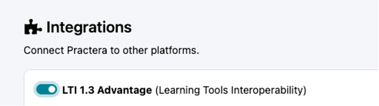
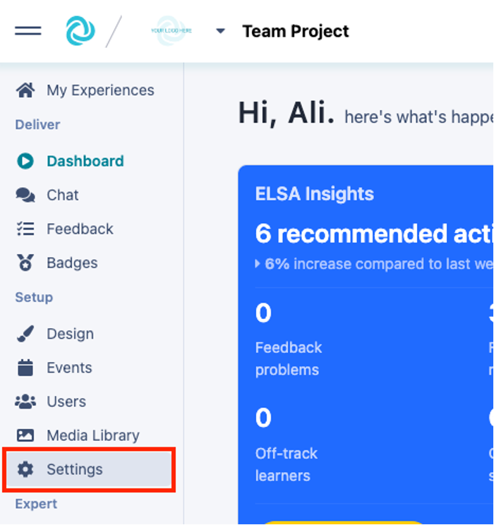
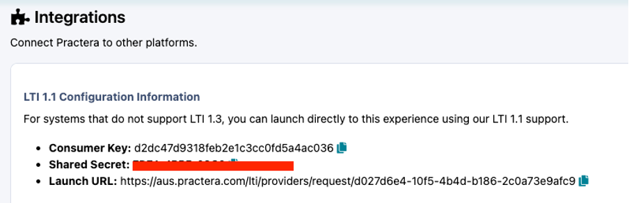

# Integrating Practera to Moodle

Learn how to set up an LTI connection with Single Sign On so that you can seamlessly host your Practera app within your Moodle course.
You are a Program Admin whose institution delivers all online course content on their Moodle LMS. You would like students to be able to access your Practera app without needing to:
  1. Enrol students in Practera
  2. Manage student enrolments in Practera
  3. Require students to log into your Practera app in addition to Moodle

The steps below will help you create an LTI app in Moodle containing Practera app identifying details.
Once the LTI app is added to your Moodle course and published, students registered on your Moodle course will automatically be registered on your Practera program. They will then be able to access your Practera app in a page in Moodle.
### Creating a Moodle LTI app

Typically, an IT administrator would
  * Add a new External tool
  * Add the tool URL
  * Add the Shared secret
  * Add the Consumer key
  * Set visibility to “Do not show; use only when a matching tool URL is entered”

Set the **Domain** to:
  * aus.practera.com if using the Australian Stack,
  * usa.practera.com if using the USA Stack, or
  * euk.practera.com if using the UK Stack.

### Embedding the LTI App in a Moodle course

The Content developer would:
  * Navigate to the course site (in learnonline)
  * Turn Editing on
  * Locate the position you would like to add the Practera link
  * Click on Add an Activity of Resource
  * Choose an External Tool
  * Give the Activity a name: eg Practera Access (Note: this is the name that the students will see when viewing the course)
  * Add the launchURL from the integrations section under the experience settings.
  * Click on Save and return to course.

### Where do I find this information on Practera?

A Practera Institutional Admin will need to turn on LTI in the[ Institution Settings](https://practera.com/docs/changing-institution-settings/) to enable these details to be viewed. So, open a new browser tab or window, go to [**pra**](http://practera.com)[**ctera.com**](http://practera.com) and log into the Institution. Click on the Institution logo in the top left hand corner, then select “settings”. Turn on the LTI 1.3 Advantage toggle. DO NOT use the information from this settings tab, see below for information of where to locate your experience specific details.

The remaining information that is required to be inserted into this window will need to be copied from the[ Experience Settings](../onboarding/changing-experience-settings/) (Scroll down to the last section – Integration).

Scroll down until you find integrations

The information that you need to copy, one value at a time, is as follows:
  * Consumer key
  * Shared secret
  * Launch URL
  * Configuration XML

For each value above, click the copy button (the one below)next to each value.

### Testing the Embedded Practera Program

Simply log into your Moodle module with a student account and click on the newly created page. When the student clicks on the link Practera will load in a new window and they will be logged in.
