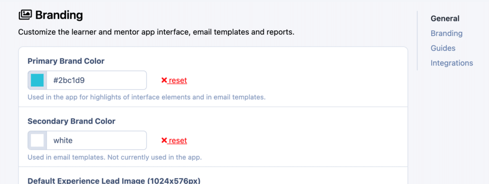
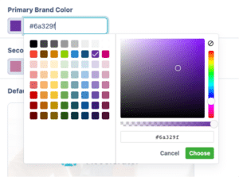
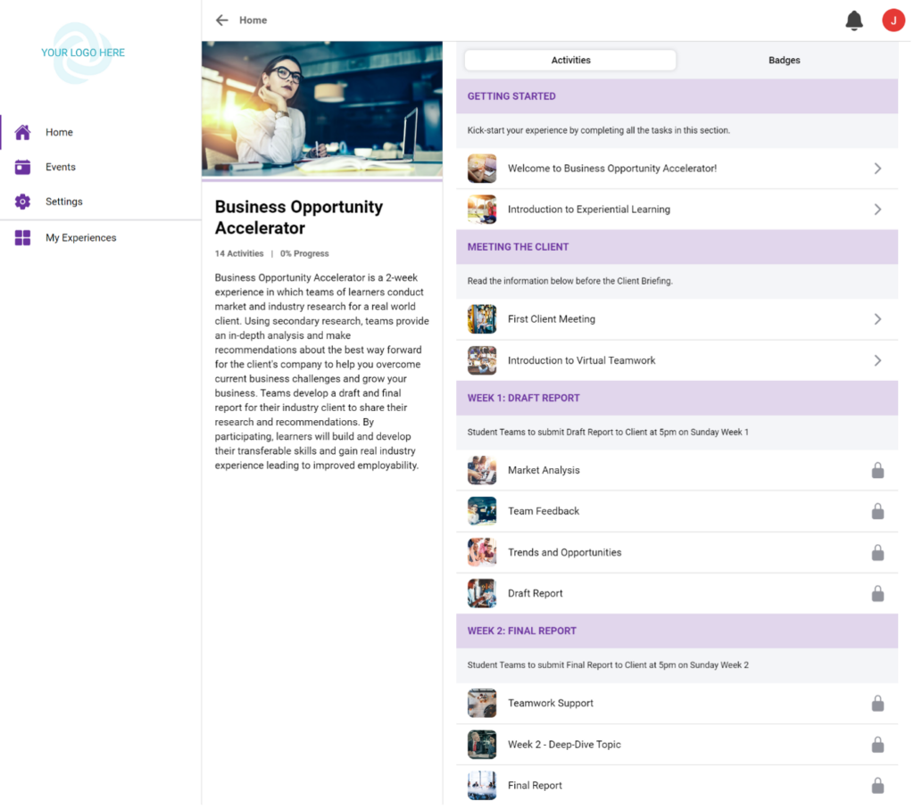
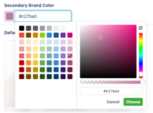
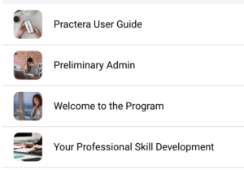
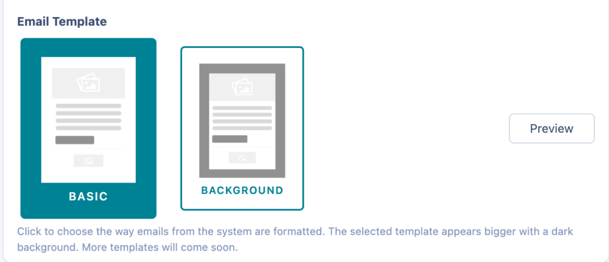

# Branding Your Experience

Learn how to make your experience your own by branding it with your colours and images.

---

## Branding Permissions

Practera allows you to customise areas of your experience to make them look and feel more like your own. However, not everyone is able to change the way an experience is branded. [Administrators](../institution-set-up/understanding-user-roles.md) can set the branding for entire institutions and [Authors](../institution-set-up/understanding-user-roles.md#authors) are able to adjust the look of specific experiences.

### Experience Branding

This means changing the way one specific experience looks on the [Learner & Expert Interface](logging-in.md#6-toc-title). This can be set or adjusted by Administrators or Authors of that experience.

### Institutional Branding

This means setting the standard branding for the [Author & Coordinator Interface](logging-in.md#5-toc-title) as well as the default branding for the [Learner and Expert Interface](logging-in.md#6-toc-title) within an institution. This can only be set or adjusted by Administrators. Please see the [Branding Your Institution](../institution-set-up/branding-your-institution.md) article to learn how to complete institutional branding as an administrator.

---

## Where to Brand Your Experience

There are a few items that can be adjusted in your experience to match your branding! First and foremost, navigate over to the Settings part of your menu:

In this section, you'll find three key areas of settings for your experience: General, Branding, and Guides. Scroll down slightly to the second section where you will see **Branding** :

Let's find out what adjustments can be made there!

---

## What Can Be Customised

In this area of experience settings, you're able to change a few key parts of the Learner & Expert Interface for your experience. 

### Available Customisation Options:

| Option | Description | Link |
|--------|-------------|------|
| 🎨 **Primary Brand Colour** | Set the main interactive colour for buttons and elements | [Learn More](#primary-brand-colour) |
| 🎭 **Secondary Brand Colour** | Configure secondary colour for links and text | [Learn More](#secondary-brand-colour) |
| 🖼️ **Default Experience Lead Image** | Set the main experience image (1024 x 576 recommended) | [Learn More](#default-experience-lead-image) |
| 📱 **Default Activity Card Image** | Configure default image for activity cards | [Learn More](#default-activity-card-image) |
| 🏷️ **Default Banner Image** | Add a branded banner to emails (600 x 250 recommended) | [Learn More](#default-banner-image) |
| ✉️ **Email Signature** | Customise your automated email signature | [Learn More](#email-signature) |
| 📧 **Email Template** | Choose between Basic and Background email templates | [Learn More](#email-template) |

---

### Primary Brand Colour

Setting the primary brand colour for your experience changes the interactive buttons and elements on the Learner & Expert Interface. In order to change this colour, you can either select from the colour map or input the colour HEX code in the text box. Once you complete this action, it will automatically be saved.

Once you've made an adjustment to your primary brand colour, it will display on the Learner & Expert interface in various elements. Below is an example:

---

### Secondary Brand Colour

Secondary brand colour can be adjusted just like primary brand colour either by using the colour map or by inputting the HEX colour code. The secondary brand colour is used in many fewer places than the primary brand colour. You will notice that it is used for some links and text in your email templates.

---

### Default Experience Lead Image

This is the image that will display for [learners and experts on their app interface](logging-in.md#6-toc-title). It is recommended that this image have the dimensions of 1024 x 576 in order to display clearly.

---

### Default Activity Card Image

The default activity card image is used whenever you add a new activity to your experience. You'll notice that each activity in the Learner & Expert Interface has a card with the option to have an image. The ideal dimensions for the activity card images are 1024 x 576, just like for the experience lead image.

By adding a default image, you can have an image already uploaded for that activity or you can go in and add a new one. To find out how to do that, please see [Adding Activity Images](../becoming-a-practera-power-user/add-activity-images.md).

---

### Default Banner Image

Adding a default banner image adds a banner to the top of your emails. This banner image is recommended to have the dimensions of 600 x 250 in order to display the best in your branded emails. See more about branding your emails below.

---

### Email Signature

Add your email signature in this box so that it appears at the bottom of all automated emails and notifications sent from the system.

---

### Email Template

There are two branded email templates to select from: Basic and Background. These two types of branded emails will be the templates for all the emails that your users receive in your experience.

### Template Options:

- **Basic Template**: White background with your banner image at the top, institutional logo at the bottom, and supporting text in your secondary colour.
- **Background Template**: Your primary colour as background with your banner image at the top, institutional logo at the bottom, and supporting text in your secondary colour.

You can test out both of these options by selecting one and pressing "Preview":

This will send a Practera Email Branding Preview to your registered Practera email for you to check your branding settings.

---

## What's Next?

Now that you've branded your experience, you can:
- Learn about [changing experience settings](changing-experience-settings.md) to configure your program
- Explore the [Essentials collection](../essentials/index.md) to manage participants
- Continue with other [Onboarding articles](index.md) to complete your setup
