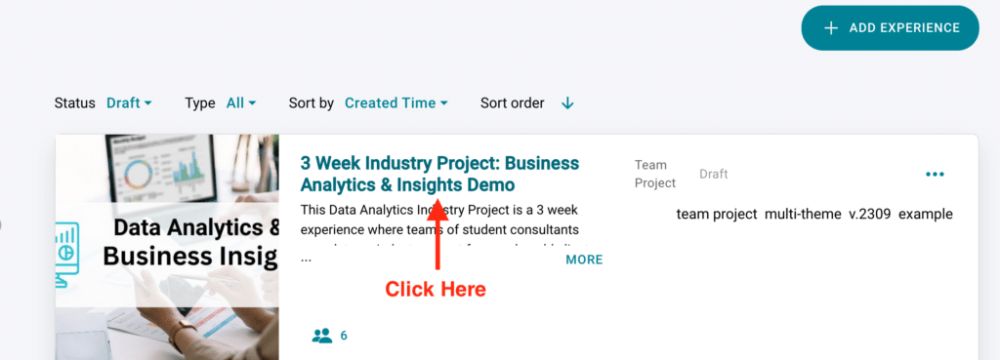
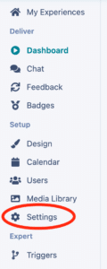
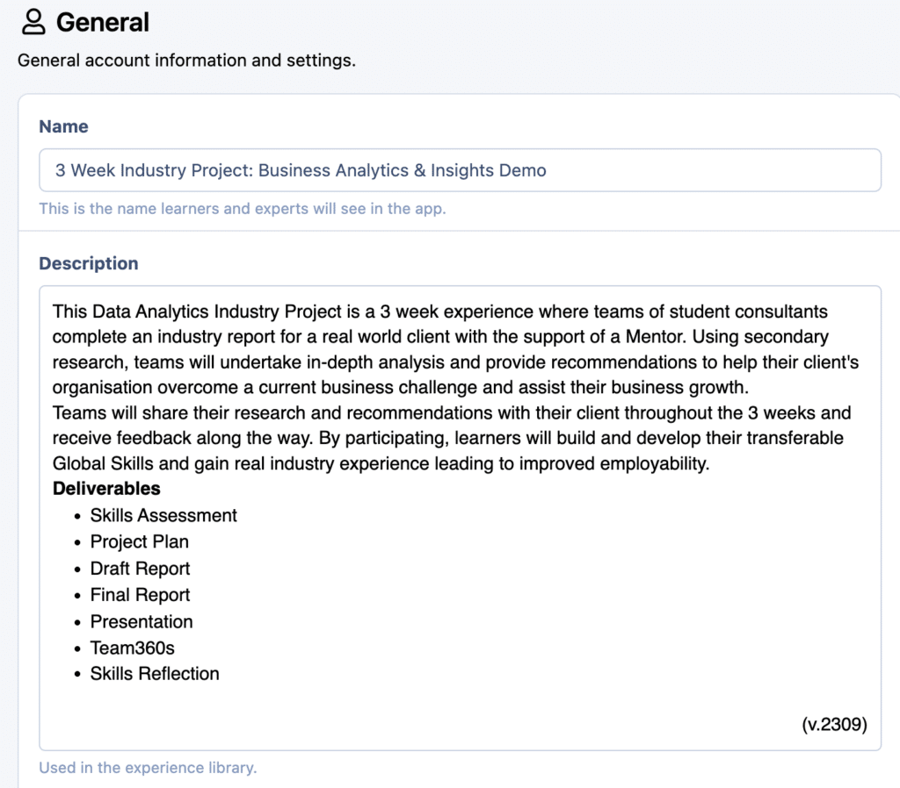
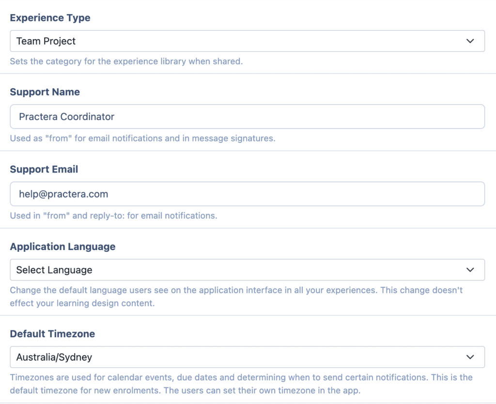
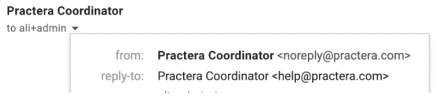
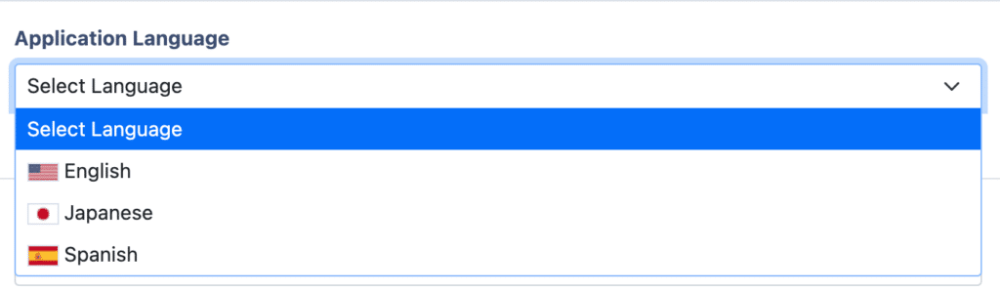
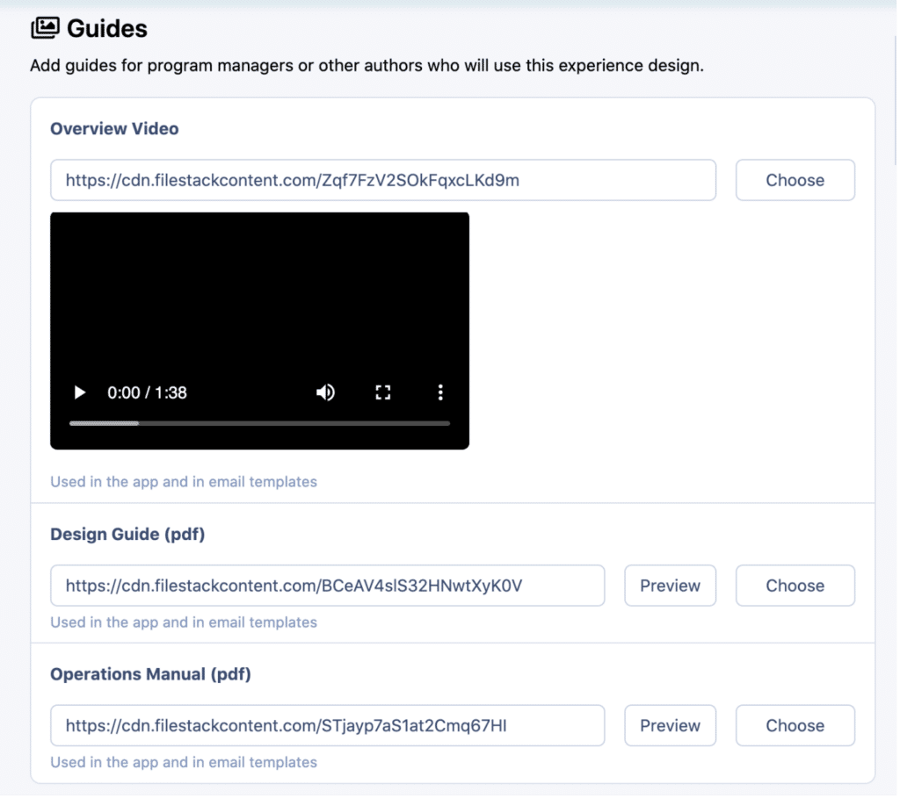
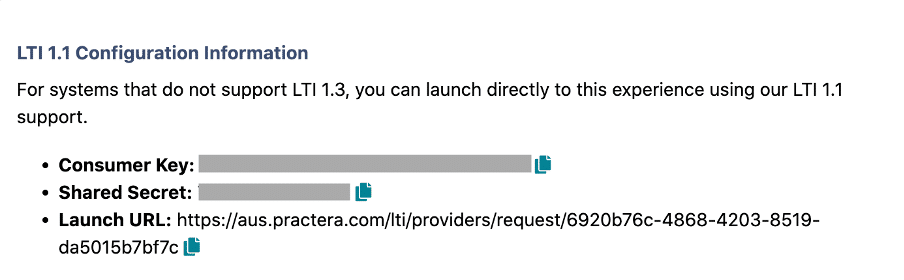

# Changing experience settings

Learn how to configure general settings, branding, guides and integrations

---

## Where can I edit the Experience Settings?

Practera is designed so you are easily able to set and edit all branding and settings related to your experience or institution. Institutional Settings are set up by the [Administrator](../institution-set-up/understanding-user-roles.md) and act as the default settings for all experiences created. However, [Authors](../institution-set-up/understanding-user-roles.md#authors) and Administrators are able to adjust the look of specific experiences if they wish it to differ from the default Institutional Settings.

To edit your experience, click on the relevant experience tile, then select settings on the left hand side.

Once you are on the settings tab there are a couple of steps you may want to take to update your experience.
### Step 1 – General Settings

#### Name:

Here you are able to set the name of the Experience. This will be what will be used in the emails and what the learner and expert will see in the app.
#### Description:

This is used in the experience library, allowing other Administrators or Authors to read what the template is about to decide if it is the appropriate one to use.

#### Experience Type:

If you add this experience to your template library this will set the category making it easier to find.
#### Support Name and Support Email:

The next part is to set up the Support name and email address. This works as a reply to function. Meaning learners and experts on the app are able to see emails being sent from you

#### Application Language:
You are able to change the default language users see on the app interface in all your experiences. This will not update your learning content. There are a couple of languages you can choose from including: Japanese and Spanish.

#### Timezone:

Set up the Timezone. This will allow you to set the timezone for events, due dates and also to ensure automatic notifications are sent out at sensible times to the different users.
### Step 2 – Branding

In this area of the experience settings, you’re able to change a few key parts of the Learner & Expert Interface of your experience. Allowing you to make it match your branding guidelines and making it feel more like your own. The Institutional settings will act as the default settings. However, when you set up an experience you are able to edit this on an experience by experience basis.
[This article provides full details of how to edit and set up your experience brand settings.](branding-your-experience.md)
### Step 3 – Guides

#### Overview Video, Design Guide and Operations Manual:

In this section, we’ll be exploring some useful guides, namely – the Overview Video, Design Guide, and Operations Manual. By inserting the appropriate files, you will be able to see these guides in the experience library. They allow other administrators or authors in your institution to understand what the program is about, how to run it and who the program is aimed at. Providing them with the appropriate information to be able to select the correct experience and also implement it effectively.
### Step 4 – LTI 1.1 Integrations

This section will provide you with all the information you need to set up LTI 1.1 so you can allow students to access the experience via single sign on.

That’s it, once you have filled in all of these sections your Experience settings are complete. For more detailed articles on how to integrate Practera with Canvas or Moodle have a read of our [Integrations articles](../integrations/index.md)

---

## What’s Next?

Looking for more support? Check out the rest of the [EssentialsCollection](../essentials/index.md) articles and find the additional help you might need.
