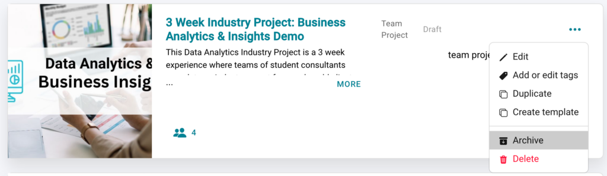
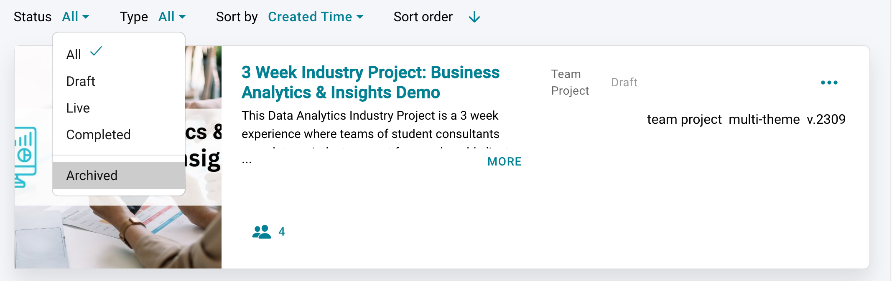
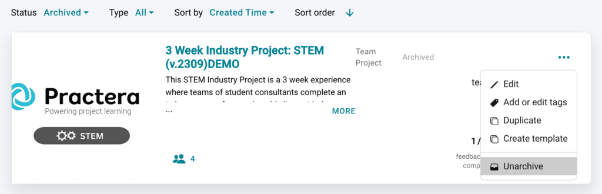
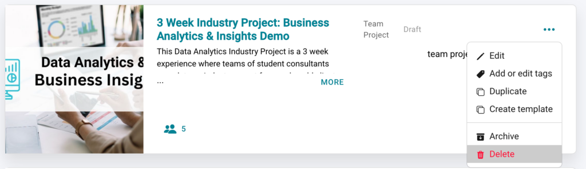

# Experience Status

This article will explain the different experience statuses, including: Draft, Live and Archived

---

## What is a Draft experience?

When you are in the initial stages of designing your experience, it will sit in draft. This allows you to keep editing and setting up the experience so it is ready to invite users on to it when it goes live. No learners are able to access the program whilst it is in draft mode.
To start designing your experience have a read of the articles in our [Onboarding articles](index.md)

---

## What is a Live experience?

Your live experiences are those which are currently running and have learners accessing the system. This experience will provide you with real time insights.
For more details on how to set your program to Live have a read of [this article](../essentials/going-live.md).

---

## How do I archive or delete an experience?

Currently our archive functionality is available for draft experiences only. It allows you to remove an unwanted experience from your visible list without deleting it. This may be a project which you decided not to proceed with. To archive an experience, click on the 3 dots on the right hand side of the experience tile and select archive.

To **view an archived experience** , click on the status drop down and select archived, this will show you the list of archived experiences for you to be able to access.

**Note:** You can also opt to unarchive and use this experience at a later date by clicking on the 3 dots on the right hand side of the experience box and clicking “Unarchive”

However, if you would like to **permanently delete** an experience you can also chose this as an option. This means you will no longer be able to access any of the information. To delete an experience click on the 3 dots on the right hand side of the experience tile, and select delete.

## What's Next?

Now that you understand experience statuses, you can:
- Learn how to [go live](../essentials/going-live.md) with your experience
- Explore the [Essentials collection](../essentials/index.md) to manage your programs
- Continue with other [Onboarding articles](index.md) to complete your setup
