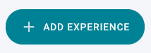
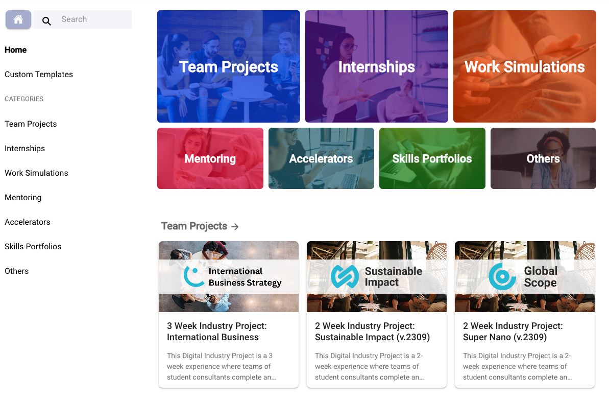

# Exploring the Experience Library

Get started on your Practera journey by exploring the available experiences in the library and understanding the experience categories.  

## Accessing the Experience Library

The experience library is a collection of tried and tested, best practice experiential learning programs available for you to use, free of charge! These experiences are either ready to launch, complete with project briefs and content, or may require some minor additions.
In order to access the experience library, select “**\+ Add Experience”** from the right hand side of your your Practera home page, just above your list of experiences:

Once you select that button, you’ll be transported to the library and have access to all the available experiences.

### Experience Library Categories

The Practera experience library is organised using categories to make your search for the perfect template that much easier. There are seven different categories to choose from and each has a selection of experiences to fit your needs. Here’s a quick rundown of the categories:
  * **Team Projects** – Learners work in teams to deliver a project for real-world feedback. Some of these experiences have built-in project briefs, others require you to provide your own.
  * **Internships** – Learners work either individually or in teams on their internship, which could include a defined project, and submit their work to their internship supervisor.
  * **Work Simulations** – Simulating real-world work situations and projects, these experiences provide learners the chance to build and flex their skills in a low-risk environment.
  * **Mentoring** – These experiences offer structured learning, feedback, and reflection throughout a mentor-mentee relationship.
  * **Accelerators** – Learners work in teams through the innovation process to develop, test, and pitch new ideas while getting meaningful feedback.
  * **Skills Portfolios** – These experiences support learners in developing specific skills or skillsets. They may include feedback loops on the learner’s demonstration of the skill.
  * **Others** – This category is a catch-all for all the other experiential learning programs you might enjoy. Have a browse and let us know if you think anything is missing!

In each category, you’ll find a selection of experiences to choose from. Each experience is described in detail and comes with supporting documentation to help you make an informed choice.
### Custom Templates

You will also notice that there is a category called “Custom Templates”. This is a curated category managed by your organisational administrator and may include experiences that you or your colleagues have created that are fit for purpose for your organisation. This category is only available to administrators in your institution, not to the broader public. Connect with your organisational administrator if you would like to add an experience to the Custom Templates category for others to use.

---

## What’s Next?

Now you know how to get to the experience library and what you’ll find within it! Would you like to continue on your journey and learn how to select an experience?
[Selecting an Experience](selecting-an-experience.md)
