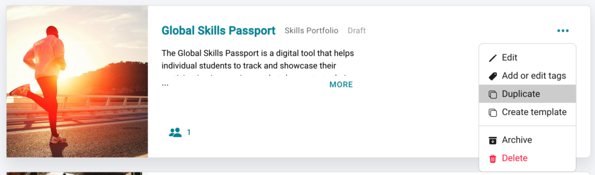
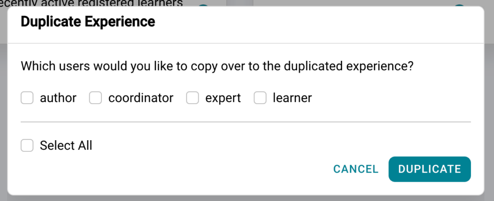

# How to Duplicate an Experience

## How do I duplicate an experience?

Once you have designed or run your experience, you may decide you wish to make a duplicate so you can utilise this experience with a new round of learners.
**Step 1:** Go to the relevant experience tile
**Step 2:** Click on the 3 dots on the right hand side
**Step 3:** Select “Duplicate”

**Step 4:** Select if you would like any users copied over with the experience

Once the experience is duplicated you will automatically be taken to the design page of this new experience. You can then edit the experience to suit the needs of the new program. (Need help with designing the experience have a read of our [Practera Power](../becoming-a-practera-power-user/index.md) user collection)

---

## What’s next?

Want more information on how to utilise Practera to get started on your Practera journey, have a look at these articles in our Onboarding collection.
[Onboarding Collection](index.md)
