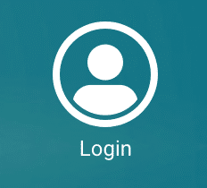
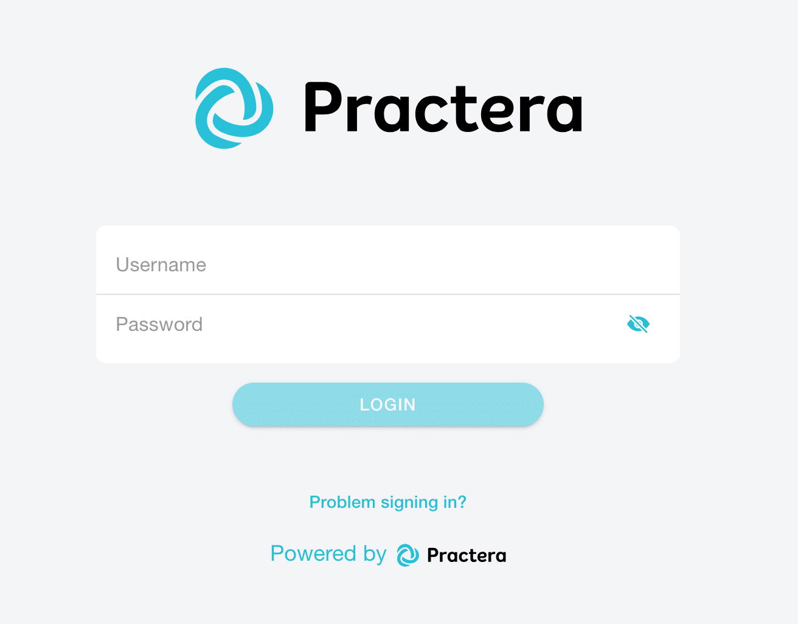
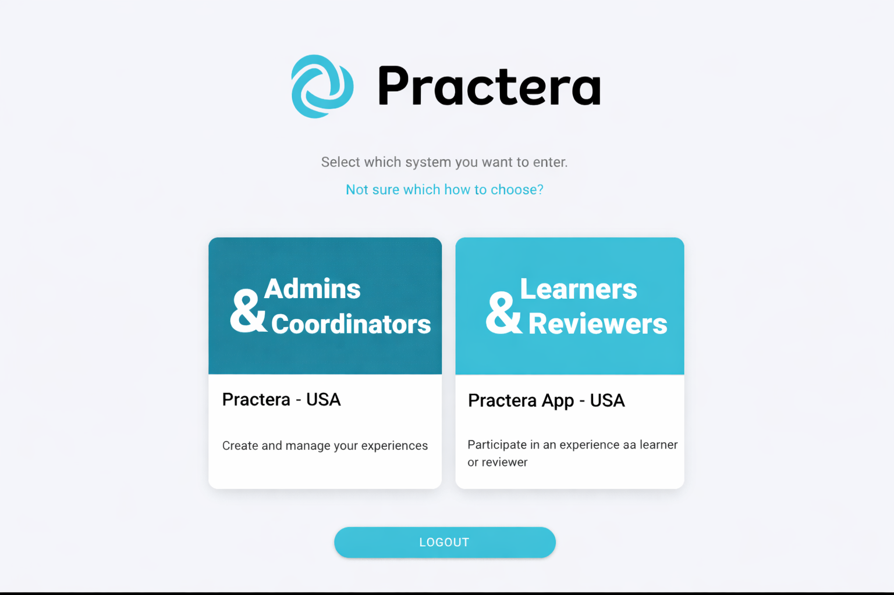
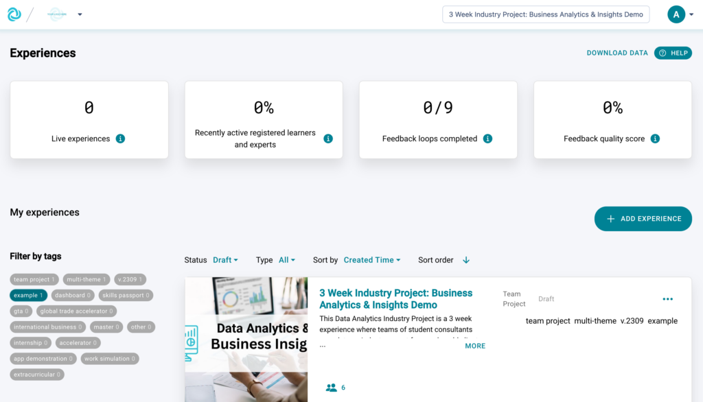
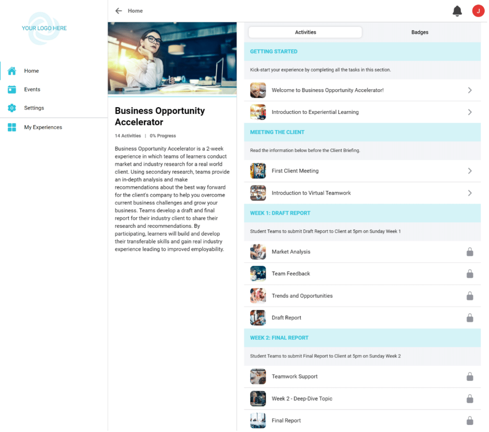
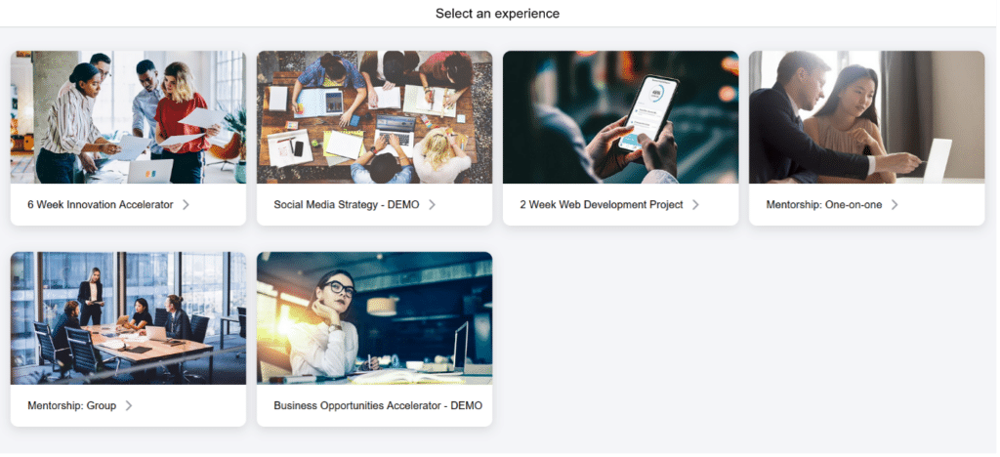

# Logging In

Find out how and where different Practera users can log in and access their experiences.

---

## Where to Log In

Anyone can log into Practera at either [login.practera.com](https://login.practera.com/login) or on the [Practera website](https://practera.com/). If you are logging in through the Practera website, you’ll need to click on the login button in the top right corner of the page.

### Log In

Here’s what your login screen will look like:

You will need to input the email address you’re registered with and your password in order to login.
### Forgotten Password

If you can’t remember your password, simply click [Problem signing in?](https://login.practera.com/forgot-password), input your email address, and Practera will send you a password reset.
### System Selection

If you have access to more than one system on Practera, you’ll next get to select which system you’d like to access:
Have a look at the role specified, the name of the system, and the description to decide which one you need! Authors and coordinators access a different interface than learners and reviewers. Read on to find out more about these interfaces.

### Author & Coordinator Interface

Authors and coordinators access Practera in order to create, manage and deliver their experiences to learners and experts. This interface allows authors and coordinators to build their experiences and track their progress!
When you log in as an author or coordinator, you will land on the My Experiences page, which will look something like this:

### Learner & Expert Interface

Learners and experts access their Practera experience through the Practera App – a progressive web-app that can be used in a browser, no download necessary!
When you log in as a learner or expert, you’ll be redirected to the home page for your experience, which might look something like this:

If you have registered to participate in multiple experiences, logging in will lead you to an experience switcher page that lets you choose which experience you would like to access.

If you aren’t sure which type of user you are, please check out the [Understanding User Roles](../institution-set-up/understanding-user-roles.md) article.

---

## What's Next?

Now that you know how to log in, you can:
- Learn about [the Experience Portal](the-experience-portal-explained.md) to navigate the interface
- Explore [Onboarding articles](index.md) to get started with your experience
- Check out the [Essentials collection](../essentials/index.md) for managing your programs
