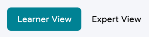
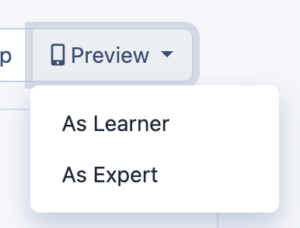

# Previewing Your Experience

Learn how to preview your experience as either a learner or an expert.

---

## Learner View & Expert View

Once you have selected an experience and it has been created, you’ve been transported to the Design page. On this page, you’ll be able to see all of the activity groups and activities within your experience.
Because Practera allows you to create separate but interconnected experiences for both learners and experts, you are able to see which activities have learner visibility and which ones have expert visibility by using the view toggle above the first activity group on the left:

If you toggle the Learner View, you’ll see all of the activity groups and activities that are visible to your learners. If you toggle the Expert View, you’ll see all of the activity groups and activities that are visible to your experts.
In some cases, these views will be very similar, in other cases they will be very different – it just depends on the experience you’ve selected!
However, keep in mind that this is your author view! This is not how your learners or experts will see their experience on Practera.

---

## Previewing as a Learner or Expert

Your learners and your experts will have a different view of the activity groups, activities, and content than you do. In order to preview what their experience will look like, you can use the “Preview As” function above the first activity group on the right:

When you select “As Learner” or “As Expert”, a new tab will open on your browser onto the web application for Learners or Experts. This is what your Learner or Expert will see!
In this preview, you’re able to click into the activities and view content and assessments as your Learner or Expert would experience them. Test it out yourself by selecting the first activity and reviewing the content!
When you’re finished previewing the experience, you can close the browser tab that was opened.

---

## What’s Next?

Now you know how to preview your experience as both a Learner and an Expert, you’re ready to get your Learners and Experts enrolled!
[Enrolling Learners & Experts](../essentials/enrolling-learners-experts.md)
