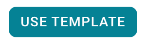
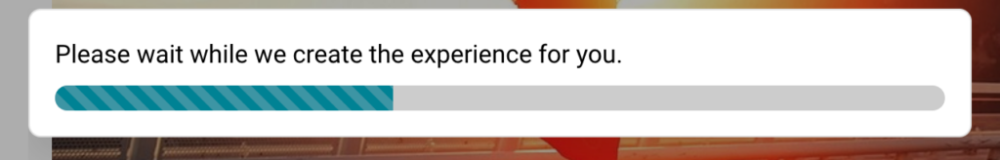

# Selecting an Experience

Learn how to select the best experience from the library for your needs.

---

## Experience Information & Documentation

When you click on an experience in the library, you’ll be taken to a page that contains all of the important information you need to know in order to decide if that’s the right experience for your needs.
### On these experience pages, you’ll find the following information:

  * **Description:** This top paragraph is a short summary of the experience, describing its key objectives, the learners’ tasks, and participation outcomes.
  * **Deliverables:** These are the work products or submissions that a learner needs to complete throughout the experience.
  * **Outcomes:** These are the learning outcomes for this experience.
  * **Level** : The Practera experience library houses experiences for all levels of learning. Check the level to make sure it’s appropriate for your learners.
  * **Length:** This is the duration of the experience.
  * **Time:** This is the expectation of time commitment per week for learners.
  * **Feedback:** These are the methods of feedback that the learner will engage with throughout the experience.

### And you will also find two important resources available to preview and/or download:

  * **Design Map:** This is a visual representation of the learner experience across the outlined length.

  * **Operations Manual:** This is a document that includes a checklist of the requirements in order to successfully run this experience.

All of this information is provided so that you can make an informed decision as to which experience will work best for you, your learners, and your experts. Once you have found an experience that meets your needs, you can select “Use Template”.
### Press “Use Template”

Found an experience that is perfect for you? It’s time to use it! On the experience page you’ll see a button above the documentation that says “Use Template”:

Once you press that button, Practera duplicates the experience for you!

You will then be taken to the **Design page** for your experience! You can learn more about editing your experience in the Practera Power User Collection.

---

## What’s Next?

Now you know what information is available in order to select the best experience and how to use the template for yourself! Would you like to continue on your journey?
[Previewing your Experiencce](previewing-your-experience.md)
