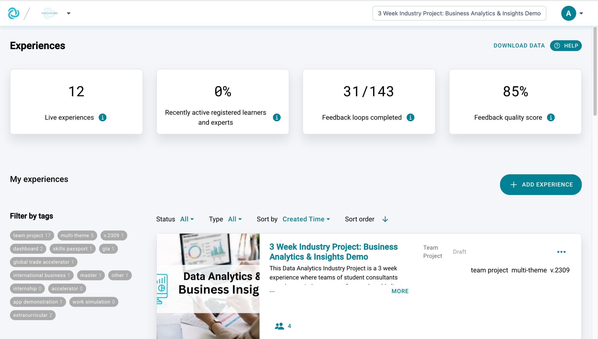
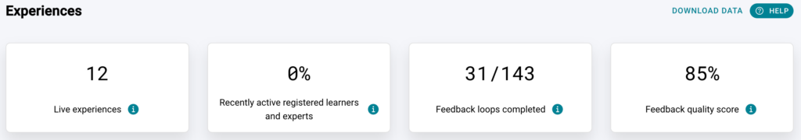
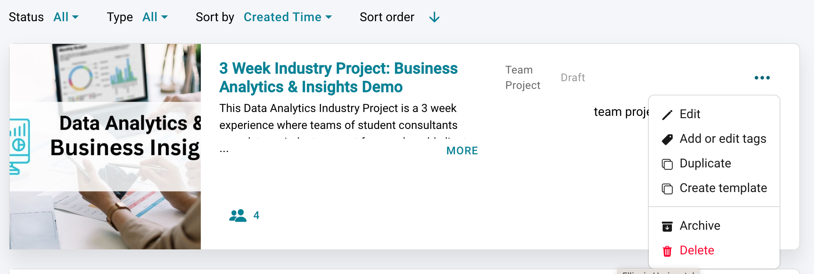
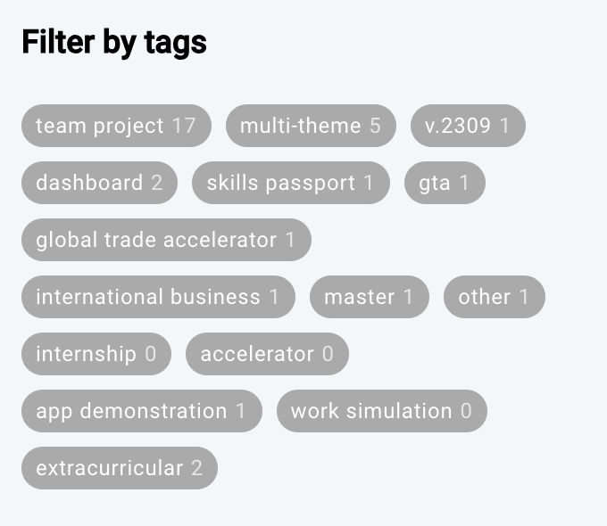
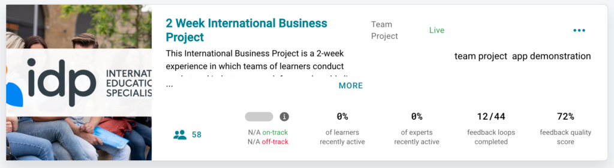
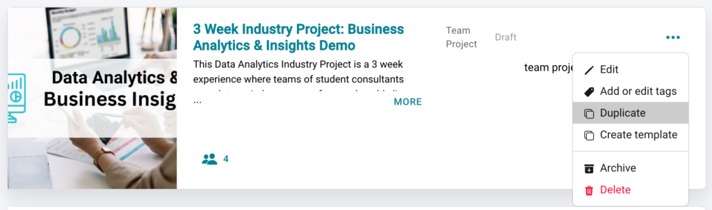

# The Experience Portal Explained

See all your experiences at a glance and add unlimited new ones from a single overview screen
This article will help you to view and organise all Practera experiences you have access to. You will learn how to **read and download your experience KPIs** , to **identify which experience needs your attention** , how you can **add new experiences** , how**tags and filters create a customised view** for you, and many more details about how the overview page can **help you to manage your experiences**.

## The Basics

Many of the [educator or admin roles](../institution-set-up/understanding-user-roles.md) need to design, manage and report on multiple experiences. So how do you keep track of all your different tasks? Let’s take a look at what we designed for you!
### From a holistic view to the detailed overview at a glance – KPI’s:

The top KPI’s give you a holistic overview of your experiences and indicate how they are going. They answer the main questions, and with a glance you can identify:
  1. How many experiences are currently live
  2. How many users were active during the last 7 days
  3. How many feedback loops are started and completed
  4. How the feedback quality is rated

Note: If you add a filter to your view, the top analytics show the data for the filtered experiences!
### Filter & Tags

If you are a [poweruser](../becoming-a-practera-power-user/index.md) of Practera. you know that you will deal with dozens, if not hundreds of experiences! That’s why we developed filter and tagging functionality. Filters let you define which experiences should be displayed.
By adding tags, you can create an unlimited amount of views which are easily accessible. E.g. you can add semester tags and then filter all experiences for a certain semester. Or you create course tags, which let you easily display and compare experiences you delivered in the same course over multiple semesters.
To add tags, click on the 3 dots on the top right of the experience card, then click the “ADD TAGS” label on the experience card and enter your custom tags. If you want to re-use a tag, start writing its name and Practera will suggest the relevant tag to you.

You can filter by type, status and/or by tags (simply click on the tags on the lefthand side).

### Experience Cards

Once live each of your experiences has their own summary card to give you a top level overview. The card also indicates if your experience needs your attention.

  * **Recently active learners and experts –** Reflects the percentage of participants who logged in at least once during the past 7 days out of the total number.
  * **Feedback loops completed –** Reflects the started and completed feedback loops. A feedback loop counts as completed if all stages are completed, for example if it is a moderated assessment this includes: 
    * Assessment submitted by a team or individual
    * peer/expert/coordinator/author/admin reviewed assessment and submitted feedback
    * Team members/individual has read the feedback
  * **Feedback quality score** – This is the average rating given by learners to experts/reviewers feedback based on how helpful they find it (on a scale of 0-100%). It is done at the end of the feedback loop and can happen multiple times during the course of the program (e.g. moderated assessment).

A feedback loop helps participants to process the way they learn in practice and is triggered after certain events (e.g. moderated assessment) which can happen multiple times over the duration of a program.

---

## Exploring and adding a new experience

_These articles explain_[ _how the experience library works_](exploring-the-experience-library.md) _and_[ _how to add a new experience_](selecting-an-experience.md) _to your institution._
### _Duplicate an experience_

You want to re-use your experience? Simply open your institution overview page, navigate to the experience you want to duplicate and click on the three dots of your experience card to choose the “Duplicate” option.

Next to duplicating your content you can also choose to copy your users (authors, coordinators, experts, learners) along with the content and don’t worry – since all duplications start in “Draft” mode***** your users will not see what your are building until you go live.

_Have a read of the article[“Experience Status”](experience-status.md) to understand the different experience statuses and what it means for you and your users (Draft, Live, Completed and Archived)_

---

## What's Next?

Now you know how to easily manage your experiences using tags, filters, and data tools. You can:
- Learn about [experience statuses](experience-status.md) to understand different states
- Explore the [Essentials collection](../essentials/index.md) to manage your programs
- Continue with other [Onboarding articles](index.md) to complete your setup
