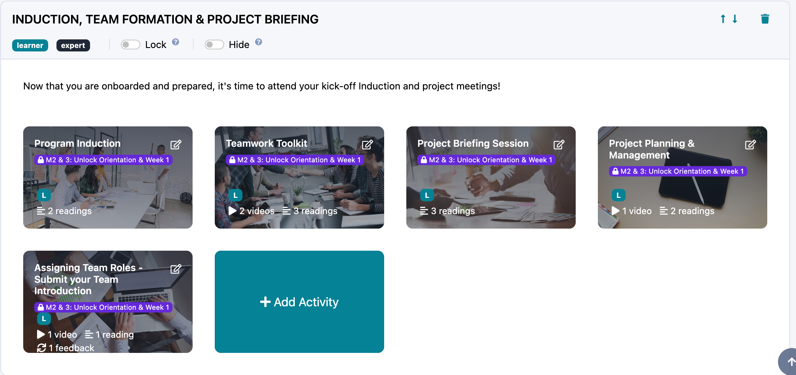
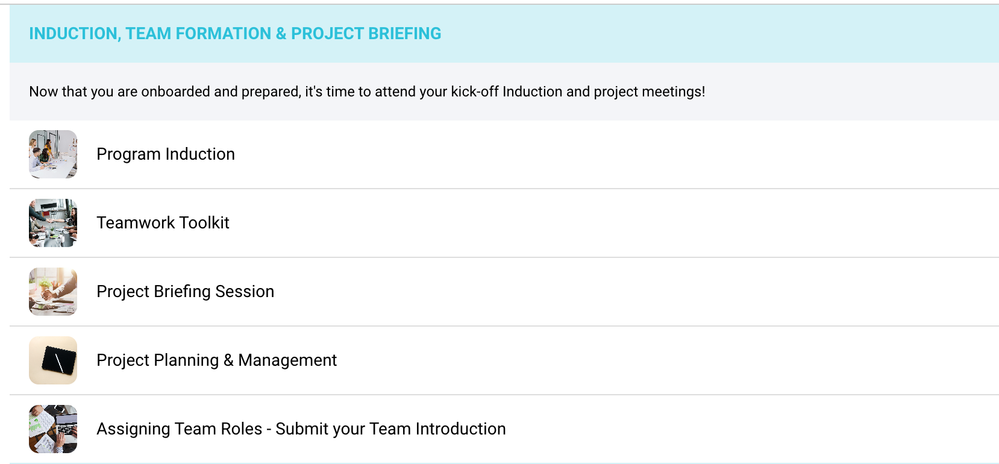
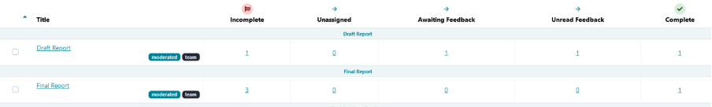
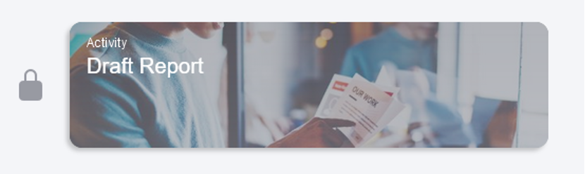
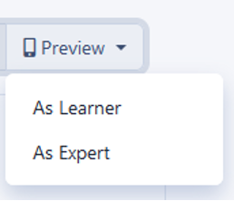

# The Practera Glossary

Discover the key words and expressions you’ll come across when using Practera.

---

## Terms A-C

### Activity Group and Activity

Activity groups (sometimes also referred to as milestones) and activities are integral parts of every Practera experience. Structurally, activities sit under activity groups. Each activity group can have one or more activities. Similarly, each activity can have one or multiple components (that is, instructions or feedback).
In this screenshot, INDUCTION, TEAM FORMATION & PROJECT BRIEFING is an activity group (Milestone), and Program Induction, Teamwork Toolkit, Project Briefing Session etc are the activities.

And this is how they appear in the learner view.

### App

Our Practera mobile interface is a Progressive Web App (PWA), which means that it looks and feels like an app but is accessible on all devices without downloading anything.
### Badge

Badges are automatically earned by Practera users participating in learning experiences when they fulfil certain conditions. Badges and rules that trigger the badges’ appearance can be configured by authors and administrators. Activity groups, activities, instructions, and feedback can be locked or hidden until a user is awarded a specific badge. Authors and administrators can also manually award badges, even if the badge rules have not been met.
### Chat

Practera chat function allows experience participants to easily communicate with each other. For example, learners can chat to the members of their team, to their team + an expert, to their team + an expert + and an experience administartor, or send individual messages. Authors and administrators can also set up a cohort-wide chat.

---

## Terms D-F

### Dashboard

The Practera experience dashboard is the super tool that empowers you with real-time, rich data on your cohort’s progress and performance (such as the percentage of learners active in the past week and the number of completed feedback loops) and equips you with the solutions to quickly remedy and pre-empt any issues (through a summary of recommended actions).
### Experience

An experience – also known as program, course, class, module – is a structured collection of activity groups, activities, instructions, and feedback that help educators design and deliver experiential learning. Experiences can vary in length, be team-based or individual, with or without experts, simulated or based on a real-world project brief. Examples of experiences include team projects, internships, work simulations, menoring programs, accelerators and more.
### Experience Library

The experience library is a collection of tried and tested, best practice experiential learning programs available for you to use. To access the experience library, click on the “**\+ Add Experience”** button on the right hand side of your your Practera home page.

### Experience Template

An experience template is a pre-configured experiential learning program that is either ready to launch, complete with project briefs and content, or may require some minor additions. After exporting a template to your Practera home page from the experience library, you can tweak it easily without impacting the original. When you are happy with the changes you’ve made, you can change the status of your experience from draft to live to make it available to learners and experts.
### Feedback

All assessments configured on Practera are referred to as feedback. You can add different types of feedback to your activities by toggling an activity editor and dragging and dropping feedback into your activity architecture. The most important feedback type on Practera is a moderated assessment, which lets learners submit their work for expert review.

### Feedback Loop

A Practera feedback loop consists of:
  1. A moderated assessment submission by a learner or a team
  2. Expert review of that submission
  3. Learner rating of the feedback helpfulness

Administrators, authors, and coordinators, can monitor the progression of each feedback loop in the feedback section of their experience. Once a submission has moved all the way through through to the “Complete” column, the feedback loop has been closed.

## Terms G-I

### Hiding

Activity groups, activities, instructions, and feedback can be hidden from learners or experts until they meet a certain set of rules or earn a badge to trigger the reveal of that content. When designing your experience on Practera, you can easily recognise which items have been hidden by looking for the following symbol.

### Instruction

Instruction is the Practera term for a piece of content, which is to be consumed by learners or experts via the app to assist them with completing their experience.

---

## Terms J-L

### Locking

Activity groups, activities, instructions, and feedback can be locked from learners or experts until they meet a certain set of rules or earn a badge to trigger unlocking of that content. When designing your experience on Practera, you can easily recognise which items have been locked. The example below shows you a locked activity.

Learners and experts will also be able to see locked content on their app home page.

## Terms M-O

### Notification

Notifications are system messages that notify Practera users about important events, such as availability of feedback, via email, SMS, or in-app messages.

---

## Terms P-R

### Pulse Check

The Practera pulse check lets you stay on top of the sentiment within your experience. It allows you to get a real-time measure of how your learners and experts are feeling about their progress, enabling you to detect the need for experiential learning interventions earlier than in any other system.
### Preview

As you design your experience, you can preview it on the app by simulating learners or experts. You can find the “Preview” button by selecting an experience on you home page and going to the design section of that experience. The “Preview” button will be on the right hand side of your screen, above your first activity group.

### Reviewer

A reviewer is a person (usually an expert) who provides feedback on a moderated assessment submitted by a learner or a learner team.

---

## Terms S-U

### Submitter

A submitter is a person (usually a learner or a learner team) who submits their work in a moderated assessment. If it is a team moderated assessment, only one team member needs to submit it on behalf of the group.
### Team

A team in Practera is defined as a group of users who are going through an Experience together. Teams can vary in size and consist of a combination of learners and/or experts. For instance, 1 expert and 1 learner would be a typical team in a work placement scenario, and 1 or several experts and several learners would suit a project-based learning experience. Authors, coordinators, and administrators can create teams within a particular experience by going to the Users section of that experience.
### Trigger

Triggers are sets of rules that are used to determine when a badge is earned and also to unlock or reveal experience content (e.g., activities).
### User

A Practera user is anyone with an administrator, author, coordinator, expert or learner license. Administrators, authors, and coordinators design and deliver the experience, while experts and learners participate in the experience.

---

## Terms V-Z

### View (Learner View vs. Expert View)

Most of the elements on Practera can be configured to be visible to only specific user roles. For example, a piece of content that helps an expert provide constructive feedback might be hidden from learners.
Have you spotted a term that is not listed here or needs a more detailed explanation?  
Send us a message, and we’ll add it in or write a separate article about it! 🙂
