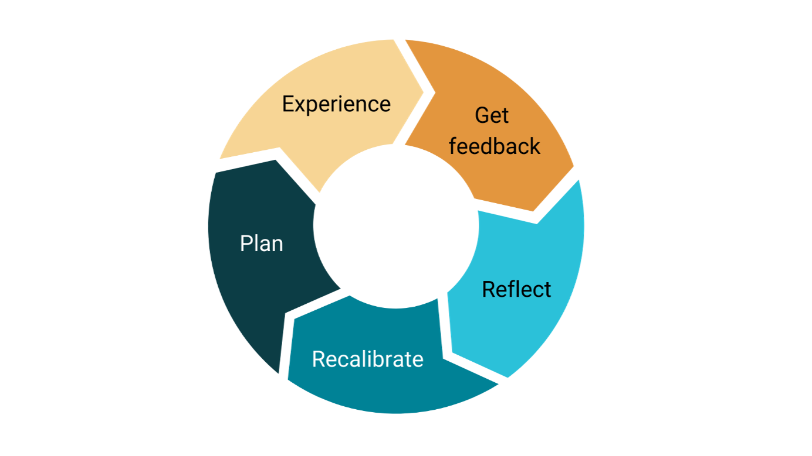

# What is Experiential Learning?

Learn about what experiential learning is and why we believe it’s so important!

---

## The History (and theory) of Experiential Learning

Experiential learning refers to learning by doing, or, learning through both experience and the reflection on experience. This hands-on approach to learning is truly tried and tested, as it dates all the way back to Ancient Greece. Even Aristotle said, “ _For the things we have to learn before we can do them, we learn by doing them.”_
Experiential learning is built on a foundation of constructivism, or, the idea that learning is constructed through the process of inquiry and reflection. Current experiential learning theory is based on the work of key constructivist theorists, such as Lev Vygotsky, Jean Piaget, Jerome Bruner, John Dewey, and Maria Montessori.
In 1984, David Kolb developed the modern theory of experiential learning and summarised it as “ _the process whereby knowledge is created through the transformation of experience.”_
As you would have already seen in your own life, learning is so much more than simply reading through content and being quizzed on it later. The best way to really understand something is to be given the opportunity to _do_ it. Kind of like riding a bike, you need to actually get on the saddle and try it (without the training wheels!).
Experiential learning empowers learners to take the knowledge and skills they acquired in the classroom and apply them in a real-world context, which makes it that much more meaningful and memorable.

---

## The Experiential Learning Cycle

One of the core concepts of experiential learning is an [experiential learning cycle](https://experientiallearninginstitute.org/resources/what-is-experiential-learning/), also put forward by Kolb. Similar to the scientific method of hypothesising, testing, reviewing, and re-hypothesising, experiential learning is presented as a cycle, that leverages ongoing learning and improvement. The good news is that this cycle continues through your entire life, so there is always opportunity to refine and polish your skills!
At Practera, we believe that feedback is an essential part of the experiential learning cycle, so we adapted Kolb’s cycle to supercharge it with feedback and created our own spin on the classic:

  1. **Experience:** Put yourself out there and get involved in a real-world experience – like working on a project!
  2. **Get feedback:** Actively seek out feedback from an expert and/or your peers.
  3. **Reflect:** Reflect on what was learned and the skills developed.
  4. **Recalibrate:** Based on your learnings, edit or adjust understanding of yourself, your performance, or project expectations. Don’t hold on to misconceptions!
  5. **Plan:** Create a plan of action to improve for the next experience.

As you can tell, completing these steps of the cycle (and then completing them again!) is crucial for learners’ continuous growth and development. So, it’s up to us, as experiential learning providers and designers, to set learners up for success by building in feedback and reflection into our programs! Keep on reading to find out how it’s done on Practera.

---

## Experiential Learning on Practera

At Practera, we believe so strongly that experiential learning is the best way to develop learners’ abilities and skills that we built our platform with the purpose to power and streamline the experiential learning cycle! From the platform itself to the experiences we design and deliver, experiential learning is our bread and butter.
### The Importance of Feedback

Let’s face it, learners will never really improve without feedback. In experiential learning, the role of feedback is essential to the learner’s movement through the experiential cycle. In fact, feedback is the most personalised and specific content you can provide to a learner!
On Practera, we’ve created feedback loops that are hassle-free, allowing experts to review learners’ work in a seamless way.
### The Power of Reflection

Reflection is all about empowering the learner to _think, observe, and express_ what they went through in their experience, encouraging them to take a moment to celebrate the achievements, and helping them identify opportunities for improvement. We can support learners on their reflective journey by asking key questions like:
  * Which skills have they developed in this experience so far?
  * How did the experience change their perspective?
  * How can they apply what they have learned to other areas of their life?

On Practera, we support reflection at every step of the experiential learning cycle, prompting learners to pause and think about their work, the feedback they’ve received, their personal progress, and their team synergy.

---

## What’s Next?

Feeling inspired? [Design your own experience on Practera](index.md) or discover how easy it is to incorporate [feedback and reflection](../designing-feedback-loops/preparing-feedback-loops.md) into learning by using one of our [Experience Library templates](exploring-the-experience-library.md)!
