# Creating New Metrics

Learn how to create new metrics for your institution.
**Note** , this is the first phase for the metrics project, currently you are able to utilise the count, sum and average function for assessment questions with a number response.

---

## Where to locate the institution metrics dashboard

The institution metrics dashboard allows you to see the library of metrics being used across your institution, create new ones and archive/edit current metrics.
To find the institution metrics library click on institution settings, then select Metrics

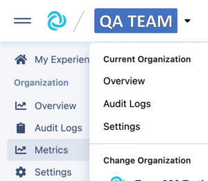

Once on the metric dashboard you can see all the current metrics created for your institution.

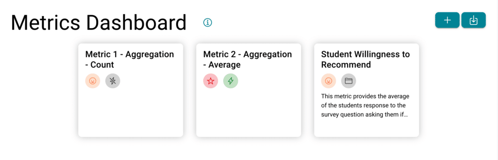
If you click on the  you will see a key which explains all the icons utilised on the tiles:
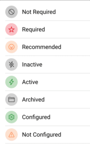

## Creating a new metric

To create a new metrics which can be used within your institution, you can click on the + icon, then create new metrics

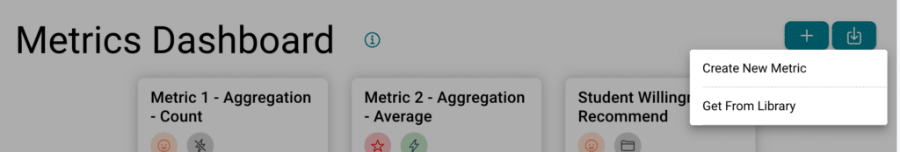

Add in the title and description

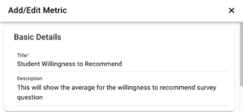

Chose your aggregation type (count, sum or average/mean)

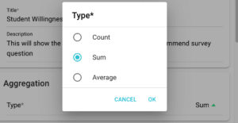

Select your filters to decide whose responses you wish to include.

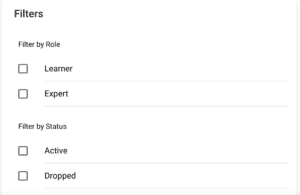

Set your requirements
  * **Required** – must be configured in all experiences within the institution before the program can go live
  * **Recommended** – advisable to be configured but will not stop the program from going live
  * **Not Required** – optional

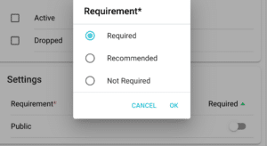

Click Save changes and your new metrics will appear in your metrics library

---

## Configuring a metrics

Once you have created the metric you will want to start adding them to your experiences. First open up the relevant experience by clicking on the experience tile.
Click on metrics under the setup menu

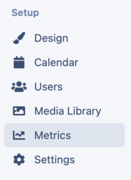

Select the metrics you wish to set up by clicking on the tile, then click configure

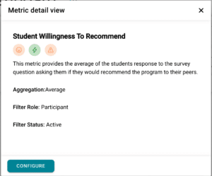

Choose the assessment from the drop down menu

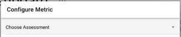

Select the relevant question the metric relates to

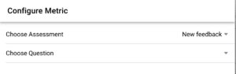

This will then show you a pop up stating that your metric has been saved successfully
You will then start seeing the data calculations once Users start to submit the assessment and respond to the relevant question, you will need to click calculate to update these figures.

