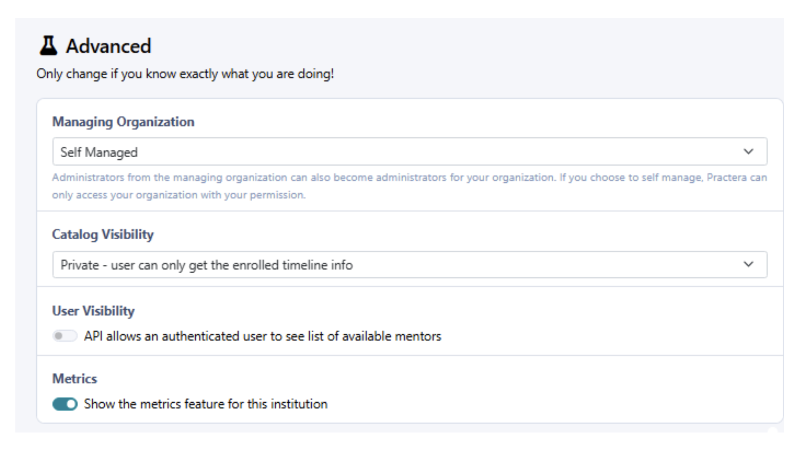
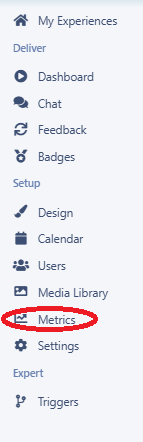
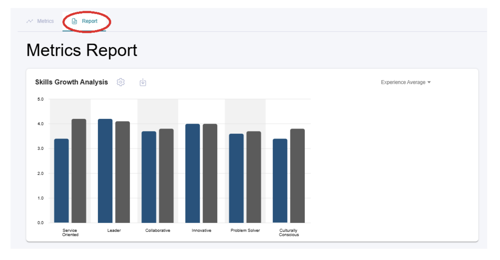
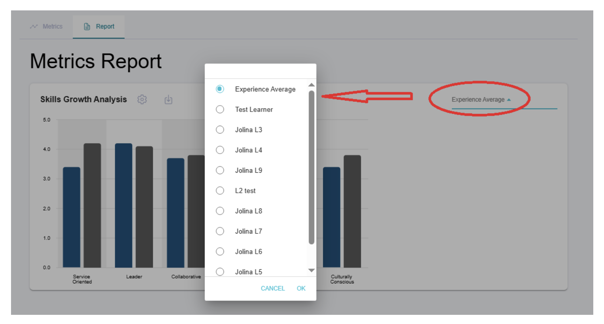
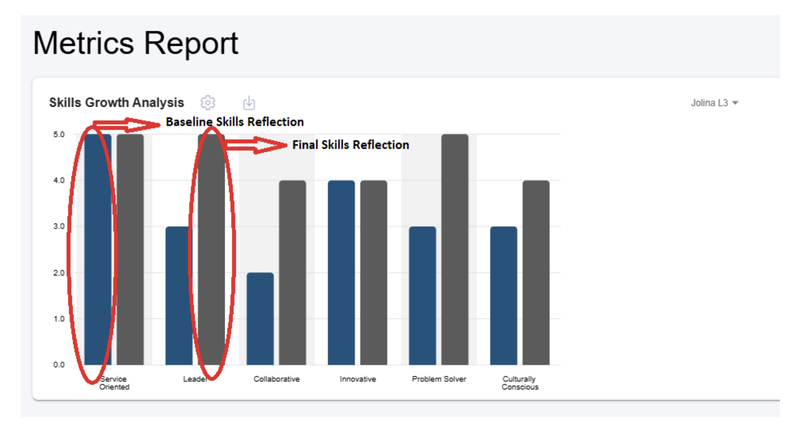

# Skills Growth Report

In addition to learners viewing their own **Skills Strength Report**, administrators now have access to a **Skills Growth Report** that provides insights into each learner's development across key skill areas. This feature helps admins understand overall program outcomes and track individual learner progress more effectively.

This report is available only to admins and must be enabled at the institution level.

---

## Before You Begin: Turn On the Metrics Feature

To access the **Skills Growth Report**, ensure that the **Metrics** feature is turned **ON** at the institution level.

If **Metrics** is **OFF**, the **Skills Growth Report** will not appear.

---

## Where to Find the Skills Growth Report

Once **Metrics** is enabled, admins can access the report by:
- Navigating to the specific program.
- Selecting **Metrics** under the **Setup** menu.

- Clicking **Report**.

This will open the **Skills Growth Analysis** graph for the program.

---

## What Admins Can See

The **Skills Growth Analysis** displays a visual comparison of learners' skill levels over time. Admins can:

- View each learner's individual skills growth
- See the average skills growth of all learners in the program
- Compare baseline vs. final skill ratings

This makes it easy to analyse development at both the individual and cohort level.

---

## Reading the Chart

The **Skills Growth** chart displays two key data points for each skill:
- **Baseline Skills** — Learners' self-assessed skill levels at the start of the program
- **Final Skills** — Learners' final skill ratings at the end of the program

This comparison helps admins clearly identify:
- Areas of significant learner improvement
- Skills where additional support may be needed
- Overall program impact on learners' development

The **Skills Growth Report** provides valuable insights into how learners are progressing, helping admins understand outcomes and continuously improve program design.

---

## Video Demonstration

Watch the video tutorial to see how the Skills Growth Report works:

<a href="https://vimeo.com/1142709572?share=copy&fl=sv&fe=ci" target="_blank" rel="noopener">▶️ Watch Video Tutorial</a>

---

## What's Next?

Now that you understand the Skills Growth Report, you can:
- Learn about [Creating New Metrics](creating-new-metrics.md) to build custom analytics
- Review [Skills & Progress Tab](../delivering-experiential-learning/skills-and-progress-tab.md) to see the learner view of skills tracking
- Check out [Pulse Checks](../delivering-experiential-learning/pulse-checks.md) to understand how skills data is collected
