# Release Notes

## 2.4.2.2 – December 18, 2024

This release is focused on bug fixes and security improvements.
### Bug Fixes

### Can’t upload new PDF file for certificate template

Fixed an issue where the certificate template upload would not display the uploader component.
### Certificate URL broken due to Amazon S3 changes

Resolved missing query parameters in signed S3 URLs to ensure proper access.
### Cursor jumps to general search bar in Teams tab

Fixed unintended behavior where the cursor jumps to the main search bar instead of the team-specific one.
### Admin can’t save assessment name

Addressed auto-save issues where updated assessment names were not retained.
### API Reset returns 500 Error

Fixed a server-side issue causing the API `/users/account/reset` endpoint to fail without required parameters.
### LHS Navigation overlaps on large devices

Resolved navigation conflicts on landscape tablets and larger screens.
### Broken S3 links resolved with updated security headers

Fixed certificate access failures caused by outdated S3 configurations.
### AI Feedback not displayed in popup

Fixed an issue where valid AI feedback failed to appear in the admin AI testing interface.
### AI Assessment executes with no expert or model selected

Prevented assessments from being saved and executed without an AI expert or model.
### On-track status not applied to all team learners

Fixed team-based assessments where “On Track” was only applied to the submitter.
### Students unable to upload badges to OpenBadgePassport

Resolved compatibility issues for badge uploads to third-party systems.
### AI JSON Errors not reported to the user

Fixed an issue where failed AI responses would not display an error, causing a perpetual “Loading” state.
### Can’t upload files to AI assistant

Addressed file upload failures for PDF and multiple uploads.
### Security Improvements

### Content Security Policy (CSP) implemented

Added baseline CSP directives like `script-src`, `frame-ancestors`, and `report-uri` to protect admin users from content injection attacks.
### Session timeout reduced

Reduced admin session timeout to minimize prolonged exposure to unauthorized access. Now, admin/coordinator users will be logged out after 60 minutes of inactivity.
### Restrict valid HTTP methods

Disabled unused HTTP methods to align to best practices.
### Private IP addresses removed

Error messages in the admin interface could be manipulated to disclose the internal (inaccessible) IP address of the server. While this didn’t pose a security risk due to network configuration, it is considered a best practice to avoid disclosing internal IP addresses.

---

## 2.4.2.1 – December 10, 2024

### Bug Fixes

### Content Editor

For TinyMCE, After Topic with Canva Iframe (from Template) Saved, AppV3 Doesn’t show iFrame  
Topic name is not displayed when <iframe> tags are entered in the topic editor (non code view)
### Assessments

For Login to Deleted Assessment via MagicLink, No suitable response from UI  
Auto-assign role in failed auto-assignment email says mentor instead of expert
When importing an “expert-only” milestone that contains some “learner-only” activities the “learner-only” activities can’t be seen in the design screen but the assessments within can still be seen in the Admin-Feedback screen  
Submission Errors for Some Assessments due to File Import Failure Response”Show Managers” option button in the Status dropdown on the Admin-Feedback screen(submissions) doesn’t show admin/coordinator submissions in the Admin-Feedback screen
### App

Error Message when Chat Question Posed  
Clicking the Messages LHS Icon Displays the Pulse Check Popup  
After the user clicks on an earned badge on the Home-Badge screen, the popup is showing the badge description as it if were unearned
The “Expert” traffic light button is covered up by the activities panel when the navigation menu is expanded on
### Dashboard  

Satisfaction Learners Responded = 0% Even Though 6 Learners Responded  
Incorrect Value for Engaged  
Percentage in yellow box action links for ELSA show 0% or Nan% while the experience already has 1 user who answered the pulse check
### AI

For Legacy AI Assessments, No AI Review Returned after Submission NOW AI MC Reviewer Question Unanswered
When Closing an AI Assessment and Opening Another, AI Popup Shows Questions and Test for Previous Assessment
500 Error when (+New Assistant) Selected
### Badges

Add ability to download the open badge itself and change the email address associated with the open badge  
Fix UI issues in the badge app and implement open badge download  
Investigate Badge Manager only shows badges earned in the experience that is currently being accessed by the user
Add text to indicate that the user has no badges in badge manager
Badge awarded emails are not sent to mailtrap once an open badge with a certificate template is earned
Duplicate entries for some users in the Badge-Earned tab in the Admin-Badges screen (Manage Recipients modal)
### Misc

Full name of an event shows up 2 times in the same event record in the calendar (List view) if the event’s name has a script/html tag  
HTML for an event’s title and location is rendered in an events booking confirmation/cancelled email  
Adding <h1> and <i> tag for the billing address as a CS Admin renders the billing address in the email based on the tags set in the field  
Datatables warning error pops up for an admin user because of timezone issue
Admin can’t view templates in the template library. Console error shows “Cannot read properties of undefined (reading ‘uuid’)”  
If Pulse Checks On, Popup doesn’t appear  
For Unteamed Learner, Confidence Value not Saved(Samsung Galaxy Tab S9 – Portrait mode)]Admin-Metrics page shows a repeating set of Admin-Metrics frames/screens inside the main container  
Styling for nav button to the most recent experience accessed has now changed  
No Real-Time Notification or Update of New Chat Messages  
Icon for empty chat screen is displayed as a broken image
Billing Address set in the settings screen is not being applied to emails being sent out. “none given” is set as the billing address  
AC3 – Incorrect Error returned if Invalid Activity ID passed in
### Security Improvements

### Prevent HTML Injection

A malicious admin user could potentially store HTML in certain fields. This would have been restricted to only affecting other admin users at their institution.
### Prevent Stored Cross-site Scripting (XSS)

A malicious admin user could potentially store XSS in certain fields. This would have been restricted to only affecting other admin users at their institution.
### Disable GraphQL Introspection

We turned off the public GraphQL documentation – this is now only available to our registered API developers.

---

## 2.4.2 – October 21, 2024

### New Features

### Super Badges Now in Beta  

Super Badges are now enabled from the institution management screen. Superbadges are “stacked” badges that are earned across multiple experiences. They work by triggering on tags added to normal badges. For example, let’s create a tag called “presentation skills” and tag badges in 3 different experiences. We want to issue the “Presentation Skills, Level 1” super badge once learners have completed 2 experiences that offer this skill. We define our super badge with two conditions associated with earning a badge tagged with presentation skills and award when both conditions are met. Once two badges with the tag are earned, the user will be awarded the super badge.
### Dashboard Links Support Multiple Actions  

Improved dashboard links to include multiple user actions.
### “Engaged” Column Added to User Table  

Added an “Engaged” column to provide better tracking of user engagement.
### Pulse Checks Can Be Updated from the App  

Learners and experts can now update pulse checks directly within the app. There is a toggle in the experience settings that allows the user to see their current pulse check status and update it.
### App Tracks User Navigation State  

Users can seamlessly navigate back and forth, with the app remembering their previous screen state.
### “Bookmarks” for Student Progress  

Bookmarks have been added to help students track their progress.
### Bug Fixes

### Experience Pane User Count Incorrect

Fixed an issue where the Experience Pane displayed “0 users” even when users existed.
### Confidence Value Shows “NaN%”

Resolved a bug where the confidence value appeared incorrectly as “NaN%”.
### Pulse Check Report Card Fix

Fixed the parsing of JSON values for confidence and satisfaction in the report card.
### Expert Pulse Check Incorrect Values

Addressed erroneous “Expert” values during Pulse Check submissions.
### Expert Pulse Check Submissions Not Reflected

Fixed an issue where submitting Expert Pulse Checks had no effect.
### Report Parsing for Pulse Check Stats

Corrected JSON parsing for multiple pulse check updates.
### JWT Code Fix for Certificates

Resolved session data issues affecting certificate generation.
### AppV3 Widescreen Optimisation

Improved UI responsiveness on widescreen monitors.
### Default Engagement Period Mismatch

Fixed default engagement period inconsistencies for new experiences.
### Bulk Invite Queue Progress Bar

Fixed an issue where the progress bar was not displayed immediately.
### User Role Terminology Alignment

Aligned exported user roles (“Learner” and “Expert”) with app terminology.
### Secret Badges Not Displayed

Fixed missing display of secret badges in the badge tab.
### Activity Import Redirect Loop

Resolved a redirect issue when importing JSON files into activities.
### DOCX Export Issue for ECU Template

Fixed export failures caused by broken images.
### Copy Magic Links Returns 403 Error

Resolved permission errors for copying user magic links.
### Content Formatting in Moderated Assessments

Fixed bulleted/numbered list formatting requiring multiple clicks.
### Empty AI Response Files Fixed

Resolved an issue where AI Assistant responses returned empty files.
### AI Feedback for Multiple Choice Fixed

Resolved missing feedback for AI assessments with “multiple choice” fields.
### Security Improvements

### JWT Session Security Enhanced  

Improved JWT handling to ensure session data integrity.
### Admin / API upgraded to PHP 8.3

Upgraded server environment to support the latest PHP version.

---

## 2.4.1.1 – October 18th, 2024

### Bug Fixes

### Progress circle incorrect

Fixed the student app progress circle to show correct progress.
### Security Improvement

### Reviewer question information incorrectly returned for assessments API call when in learner role  

This had no user impact, it simply was providing too much information via the API; this has been corrected.

---

## 2.4.1 – October 3, 2024

### New Features

  * **Updated AI Feedback Functionality Supporting Assistants (OpenAI)**
    * For those customers who have an OpenAI API key of their own, or have obtained one from Practera Customer Success, you’ll now be able to build Assistants in the Organisation configuration screen. Assistants are “customised” versions of GPT that can receive special instructions and consider additional information presented in files. These assistants can be used to provide very tailored feedback for assessments. When configuring an assessment, you’ll now be able to select one of the assistants you’ve defined to provide feedback as well as the “raw” models. The AI testing interface has also been overhauled to make it much easier to design & test your feedback systems.

  1.      1. 

  * **Ability to Export “Engagement Logs”**
    * Administrators can now easily export a CSV for engagement logs, which provide detailed insights into user activity and participation. This new functionality enhances tracking and reporting capabilities for project performance and user involvement..
    * To access the engagement logs, go to Users, then Export and select User Engagement logs

  1. 

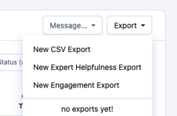

  * **New Pop-up Notification for New Releases with Rating Feature**
    * Upon each new release, users will now see a notification pop-up that highlights key updates. This feature also allows users to rate the release directly from the notification, providing instant feedback to the development team.
    * After each release, use the pop-up window to quickly rate the updates and provide feedback to the development team.

  1. 

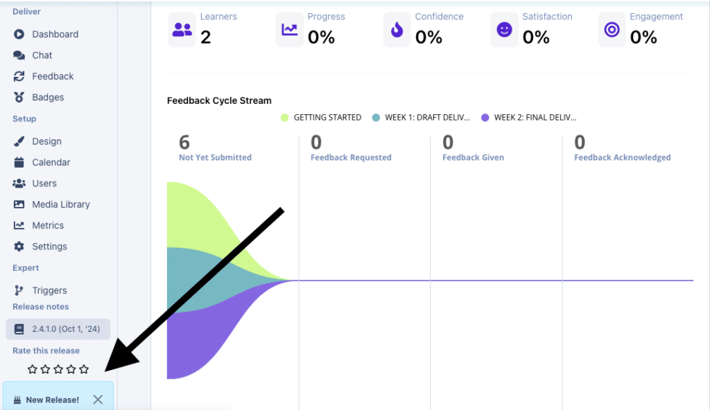

  * **CS Admins Can Export Release Rating Information**
    * Customer Success (CS) administrators now have the ability to export ratings of new releases provided by end-users. This facilitates better evaluation of updates and supports data-driven decision-making for future improvements.

### Feature Enhancements

  * **Assessment Submission: Highlight Missed Required Questions**
    * When submitting an assessment, users will now see missed required questions highlighted, prompting them to fill in any overlooked fields before final submission. This feature ensures a smoother and more efficient assessment process.

### Bug Fixes

  * **Empty submission during assessment review**
    * Fixed an issue where an empty submission was unexpectedly generated during assessment review, causing the UI to malfunction.

  * **Duplicate system entries for administrators**
    * Resolved duplicate entry issues in certain views for system administrators, streamlining the user interface for better clarity.

  * **Chat issues**
    * Fixed broken images in chat channels
    * Added user role labels to chat channels

  1.      1. 

  * **Metrics enhancements**
    * Improved UI of metrics configuration pop-up
    * Error indicator included if the title is too long

  1.      1. 

  * **Open badge toggle stays the same upon duplicating a program**
    * Fixed the bug where the open badge toggle becomes disabled upon duplicating the experience.

  1. 

A variety of other bugs related to UI inconsistencies, user experience, and performance issues have been resolved to improve overall system stability and responsiveness.

---

## 2.4.0.3 – August 20, 2024

### New Features

### Points and Badges export

  * Added functionality to include points and badges earned on the users export.
  * To access this, go to users, then click export in the top right corner of the users table. Select the relevant items you want on your export.
  * Select “Achievement points” (Total number of points earned in the experience by the user) and/or “Badges earned” (Shows the list of badges earned for each user).

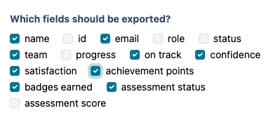

### Bug Fixes

### Email Fixes

  * **Incorrect Team Change Email:** Users who were never part of a team no longer receive the incorrect “Your team has changed” email, and instead receive the correct “You are now part of a team” email.
  * **Locked Assessment Access Via Magic Link:** Learners can no longer access a locked Team360 assessment through magic links in reminder emails.

### App/learner Fixes

  * **Unlocking Activity Groups:** Activities and groups now unlock immediately after meeting the required conditions without needing a page refresh.

### Admin Fixes

  * **Feedback Table Search Function:** The search function on the feedback table will now let you search in all tabs for the relevant learners names.
  * **Users/Enrolment Export:** Enrolment export data now excludes assessments that learners don’t have access to.
  * **Assessment Review Display:** When using the AI review and the allow resubmit feature together, the response for the AI review will always display the most recent one, and not the previous review.

### Design/Program Setup Fixes

  * **Assessment Calendar Issue:** The assessment due date event on the calendar no longer covers two days when set between 12:00 AM – 7:00 AM local time.
  * **“Members of a Team” Trigger:** is now working.
  * **Deleted Topics:** Deleted topics no longer appear in the admin edit list and cause errors in the app.
  * **Topic Completion Trigger:** The 400 error that occurred when completing a topic which is required to unlock an assessment has been fixed, and the topic no longer gets stuck loading.

## 2.4 – August 5, 2024

### New Features

#### Metrics MVP has been released
You now have the ability to set up metrics in your experience and institution. The metrics are in the first phase and are currently designed to allow you to get averages,sums and counts for specific assessment questions. 

For example in the “Participant Feedback Survey” in our templates we ask the learners:  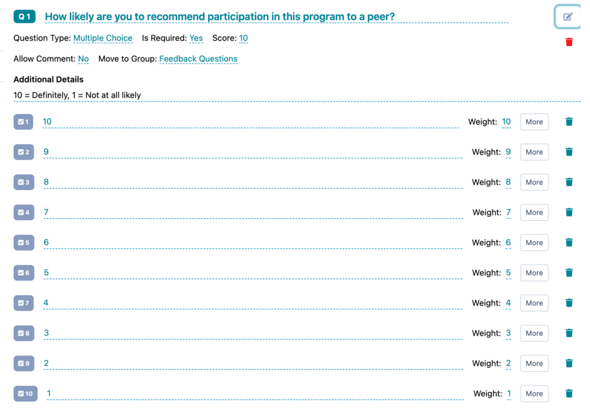

A metric related to this question needs to be created at the institution level, and then configured in each relevant experience. The results will display on the experience metrics page. See example below:

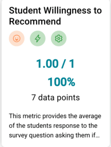

This [help article](../practera-metrics/creating-new-metrics/) explains how to set up your metrics
### Feature Enhancements:

### Badge and Certificates Page

  * Displays only open badges.
  * Added functionality to download open badges and update associated email addresses.
  * Shows badges earned across all institutions.
  * Improved badge descriptions UI.
  * Removed HTML tags from badge descriptions.

### Red Dot Notification

  * More prominent positioning
  * Dot on the home icon disappears after all unread content is viewed

### Enhancements

### Email Updates

  * Improved content for “Whoops automatic assignment of reviewer emails”, they now display the organisation, program, and assessment details.

### Loading indicator app

  * New loading indicator on the app for the experience page to replace the blank screen during loading.

### ELSA

  * Resolved recommended action items are no longer displayed.
  * Recent activity list now includes participant names and action items.
  * Clicking on an action item redirects to the relevant submission data page.
  * Learners no longer appear in overdue actions for expert-only assessments.

### Bug Fixes

  * Authors/admins can now switch between multiple institutions successfully, with relevant tabs displaying for the current institution only.

#### App fixes
  * Double submission of assessments is prevented, resolving submission errors
  * Chat channels only show “XX is typing” for users in that channel.
  * **Returning from an activity** to the home screen **maintains the last known position** unless new content is unlocked.
  * Team 360 reports are now viewable on iPhone, though larger devices are recommended.
  * Toast messages confirm successful review submissions and the continue button has been removed when a review has been completed by the reviewer

  * Unlocking:
    * Activity list updates as tasks unlock
    * When a user completes a condition to unlock an activity group/activity the activity or activity group will unlocks without the need for a refresh

#### Admin fixes
  * **Team 360 manual bulk reminders** are sent to all relevant users.
  * **Badges and triggers** page now shows the**correct Earned Date & Tim**e for the most recent trigger (the last condition completed).
  * Clear error messages displayed when attempting to remind all users for an experience without pending users.
  * Correct progression in the app when switching between programs.
  * Search bar added for assessment titles in trigger conditions.
  * Scheduled assessments’ names update on the calendar when changed on the design screen.
  * Enrolment export shows assessment data for those that learners have access to complete
  * Licenses page for admins can be filtered by role.

#### Design/Program set up fixes
  * Lead video now play for admins and learners (Youtube or Vimeo)
  * Topic files are displayed on both the admin interface and AppV3
  * Content and images within the admin interface will no longer appear stretched/condensed for users
  * Scheduled message number disappears once all messages are sent.
  * Instant display of admin messages in the chat channel without a page refresh.

## 2.3.2.6 – July 15 2024

### Bug Fixes

  * Ability to send out a manual bulk reminder to experts when a trigger is attached to the assessment is now working as expected (For example, the feedback survey in the micro experiences)
  * The red dot indicating unread content will now disappear from the milestone once the section is completed.
  * The issue when a member of a team submits a team assessment and it should cause the whole team to earn a trigger but only the submitter gets the trigger/badge should also be fixed for submitted by “an individual”. This is different than the issue in the correction which is specific to the #/% members of a team configuration

## Version 2.3.2.3 – June 20 2024

### Bug fixes

  * The export for team360 reports was rounding down team feedback averages ( x.5+ to x). Now it properly rounds x.5 to x+1 and < x.5 to x.
  * Now when you edit activities in the design view the activity card updates (count of videos, readings, feedbacks) without refreshing the page.

### Performance Improvement

We’ve changed the backend flow of submissions. It used to check achievements when a submission happened and would only confirm the submission after the achievements were calculated. This was particularly problematic for achievements with many conditions. Now we check for achievements in parallel so we can mark the submission as complete immediately and then notify the app of any unlocks/reveals/badges a few seconds later.

---

## Version 2.3.2.2 – June 19 2024

### Bug fixes

  * Fixed the ability to batch assign reviewers via clicking the checkboxes
  * Fixed an issue with auto-assignment and AI feedback

## Version 2.3.2.1 – June 18 2024

### Bug fixes

  * Fixed a problem with file upload filtering
  * Fixed an issue where importing activity groups and activities failed
  * Fixed an issue where the enrolment screen and report card wasn’t showing assessment completion

## Version 2.3.2 – June 16 2024

### New Features

  * **LTI 1.3 + Gradebook Support**
    * LTI 1.3 is now fully functional and it supports both dynamic and manual registration.
    * Our LTI implementation also supports gradebook passback. This is controlled by the achievements system. You can select an achievement that will send a grade back to the LMS when it is earned. The grade sent back will be the # of points assigned to the achievement.  

    * In the future we will support more sophisticated grade send-backs, please make suggestions on use cases and requirements.

  * **New System for Students to Self-Manage Badges/Certificates**
    * Students can now self-manage their badges and certificates, including downloading certificates after the original link expires, and changing their name and email and reissuing the badge and/or certificate with the updated information. This is accessed through their “settings” menu in the app, or from the “my experiences” screen.

  * **New Indicators for Unlocks/Reveals in the App**
    * Added red “dot” indicators to show newly unlocked tasks, making it easier to track progress, and improved the functionality of task close buttons.

  * **Allow “self” resubmission option for assessments**
    * A new option on the assessment editor adds a “resubmit” button which will allow students to resubmit an assessment.
    * This is most useful for AI feedback assessments where the student can change their submission, resubmit and get new feedback.

  * **Ability to Import/Export Individual Activities**
    * You can access this from the “options” dropdown when editing an activity.
    * Now you can import the entire project, activity groups, activities and individual assessments.

  * **Customisable Notifications** : 
    * Admins can now customise which automated notifications are sent via the settings tab, improving control over communication.

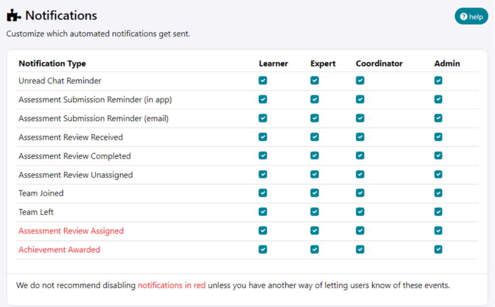

  * **Enrolment export is now configurable**
    * You can now get a very detailed progress report for all users in a cohort. This is a major expansion on the previous export.
    * There are two types of reports – a full report where each assessment appears in its own column (or two if you select both status and score) and a condensed report where all the assessments that are past due, not yet due and with no due date are grouped into a single column per user (or team). This condensed report can be used to quickly see which students have not submitted assessments that are overdue.
    * You can also group by team, which will only show one row of results per team and just show team assessments.
    * You can put in a date range; this will show all the assessments that are due within the date range – useful for longer programs.
    * If you have a particular report configuration you like, you can save it as a custom configuration; this will be available for you to use across any experience in which you are an admin or coordinator.

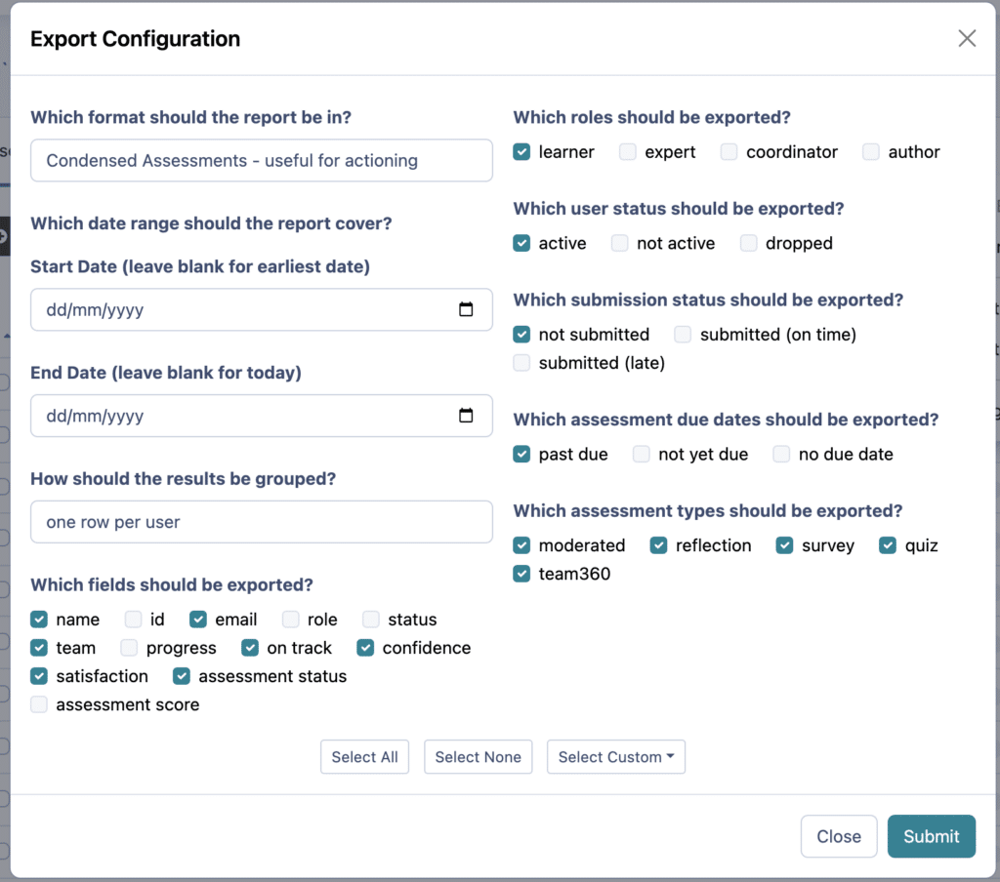

  * **In-Progress Badge/Trigger Condition Tracking**
    * Hover over the “progress” percentage to see which conditions the user met (green tick at end of condition).
    * New “check” button will recalculate the conditions for that user (like “run trigger automation” at top, which checks whole cohort).
    * You can also “reset” progress for “earned”, “in progress” users, which will send them to “did not earn”. Likewise you can award to users in the “did not earn” and “in progress” category, which will bypass the need for them to meet the conditions.

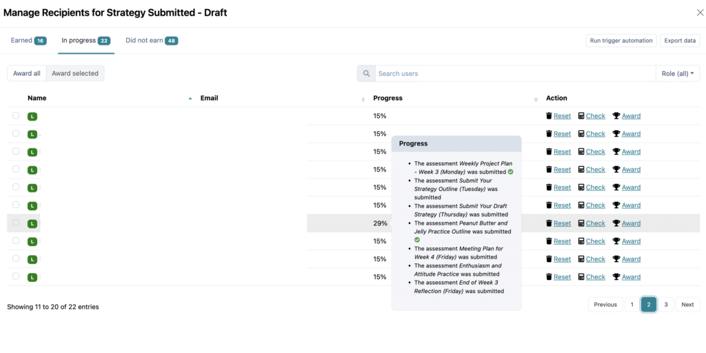 ****

### Improvements

  * **Achievement Processing System Overhaul**
    * A complete rewrite of the achievement processing system to prevent edge-case submission failures. Enhances system reliability and reduces errors in achievement processing.
    * Ability to identify which conditions have been met by the individual, allowing us to troubleshoot and respond to students queries quickly and easily. 
    * You can now see all badges earned by users, regardless of their experiences, and track their achievement progress.

  * **Tiny MCE**
    * This is now the default editor for new Institutions.
    * The issue with blacked out text has been fixed.
    * Please note, you will need to update the institution default editor for all current institutions.

### Bug Fixes

  * **Login and Registration**
    * Fixed errors and improved flow for user registration and login processes, including ensuring the login/registration button is only clickable once, resolving intermittent login issues

  * **Preview function now works correctly**
    * If you preview as a learner, you will only see the learner content. Preview as an expert will now only show expert content.

  * **Team 360 Updates**
    * Changed wording: “Allow Editing” to be “Allow resubmission” to align with the feedback page.
    * If a user selects the same peer more than once, only their first response will display on the Team 360 report.
    * Ability to send unread report reminders

  * **Badge and Certificate Management**
    * Run trigger automation should now provide certificates with the correct name.
    * Resolved an array of issues, including: ensuring badge descriptions and images display correctly (broken image is no longer displayed for the digital badge) and fixed certificate download links in emails.
    * Name on the certificates can now have a placement off centre and the name will display correctly.
    * The in-progress tab should no longer contain duplicate entries for individuals
    * ****New conditions should now autosave

  * **Messaging and Notifications**
    * CS Admins and admins are now able to send direct messages to individuals
  * **Filters on media library work better**
    * On some screens when opening the media library the wrong types of items appeared. E.g. all media would show when only an image was acceptable. This has been fixed.
  * **Codeview changes in topics now autosave**

## Version 2.3.1.8 – April 16 2024

### Design

**Text Editor** – Tiny MCE now uses browser-based spell check (Preconditions: Have TinyMCE as your editor & Have a spell-checker extension in the browser)
### Team 360 Updates

  * Ability to **view submission** , **allow editing/resubmission** and to **delete a submission** via the “manage” drop down tab.

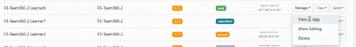

  * Same **team member selected multiple times** in the peer review section, only the first response will be picked up in the graph and for the written feedback.
  * Ability to view a Report where the user submitted a Self Assessment but no other teammates submitted
  * For Team 360 assessments with **additional MC and Text Group “Personal Reflection”** questions after the final peer review question group. These questions will now appear at the bottom of the Team 360 report to show their self reflective responses.

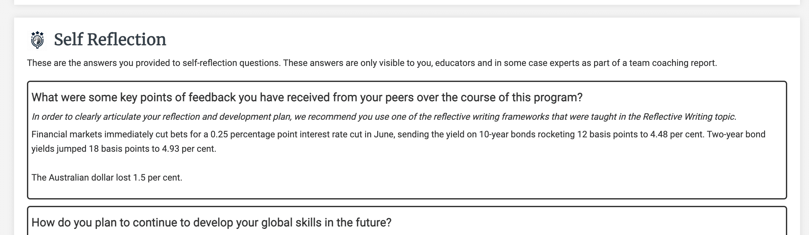

  * Issues causing the spider graphs and bar graphs to display incorrect values have been fixed

### Delivery

**Experiences status** – Ability to highlight an experience as Completed and Archived. *note this will show a tag on the experience tile so you can identify completed experiences but will not impact a learners access etc.
### Dashboard

  * Will now show you when it was last updated, with a time based on your local devices timezone)
  * Refresh data button on the dashboard is now functional – After clicking “Refresh Data“ button, the Dashboard is updated based on the most recent data in the experience

**Overview table –** Ability to view a users license in the overview licences screen – As the institution admin, navigate to the Overview screen. Go to the licenses tab and click the eye icon in one of the rows for the users representing a user within the institution

---

## Version 2.3.1 – Feb 26 2024

### Template Library:

**Ability to make a custom template Public –** If you add your template to the custom library, there is now a toggle which will allow you to make the template public, meaning it will be accessible to all users on Practera across all institutions. (*CS Admin only*).
### Design:

**Text editor –** In the Institution Settings you will now be able to select which text editor you would like to utilise when editing an experience.

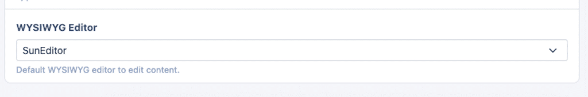

**DOCX activity export** – This provides you with the ability to be able to export whole milestones or activities into a DOCX file, making it easy to share with relevant parties so they can view the content provided within the experience. *Currently it is exporting the instructions/topics, but this will be enhanced in the near future to also export assessments
  * Go to the design page, click the export drop down menu, and select “New DOCX Export” option

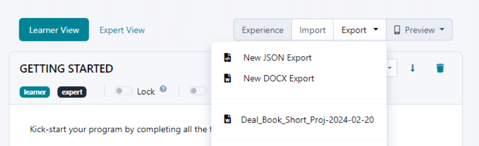

  * This will then transfer the assessments & topics into a Document which can be shared.

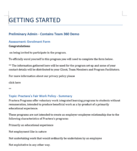

### Bugfixes:

**Assessment Submission Reminders login URL** – login hyperlink now works correctly on automatic submission reminders
**Enrolment/User Invites** – Admin can send enrolment invites in bulk and to individuals in the experience
**Event URL’s** now working correctly and directing them to the relevant page.
**Enrolment Help Icon** – Now displaying updated information
**Export** s –
  * User Export – Wording changed to show it will be exporting users onto a CSV and not a JSON
  * Export list – The time which shows on the export list will now appear in local time, rather than UTC
  * Team export – Now working correctly and only shows teams details for the experience it is exported from

**Audit Logs** – Now only shows the relevant institution data, the admin will no longer be able to view audit logs for other institutions
**Template video** – Template video now plays as expected.

---

## Version 2.3.0.5 – Feb 5, 2024

#### Bugfixes
### Team 360

Reports would not send out under several circumstances. If you published and viewed team reports in a certain order it would also lead to several reports becoming inaccessible. This would also lead to duplicate entries in the report management page. These issues have been fixed.
There was also an issue where “Invalid Date” would appear on the admin Feedback screen for Team360s with due dates
### Moderated Assessments

The “Pending Review” dropdown option didn’t match the column header(Awaiting Review) on the feedback table in the Admin-Feedback screen
### Go Live

Unscheduled due dates caution text on the go-live page was being displayed even though all assessments with due dates in the experience already have a set schedule
### App

Due dates now show on the task list and on the assessment itself it shows the timezone to prevent confusion with learners who are in a different timezone than the instructor.
Multiple Badge popups were displayed when badge is automatically earned through submitting a team moderated assessment
### Notifications

Magic links, Login links in the “Workshop Session Booked” and “Events Booking cancelled” URL were using an old app URL
### Performance

There was a situation where submitting a team assessment that was used in Triggers with more than 3 conditions associated would cause a “Submission Failed” notification – however the submission would be successful. In some cases the trigger would fail to be earned as well. These issues have been mostly resolved – there are still situations under extreme server load where this might occur. We are implementing a complete redesign of the trigger system to ensure these issues never happen regardless of server load.

---

## Version 2.3.0.4 – Jan 2, 2024

Note that hotfixes 2.3.0.1 -> 2.3.0.4 were a series of minor bugfixes released in quick succession after version 2.3.0.0 was released.
### Major Changes targeted for this release:

#### Design:
  * Designer Import/Export – 
    * **Import and Export for experiences** is now available for all users. You can use the export button at the top of the build, then create the shell experience where you will import it into.

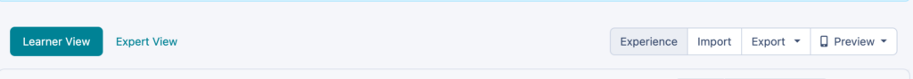

  *     * The**“Add Group”** button now appears between every activity group – this makes it easier to add a new group between other groups.

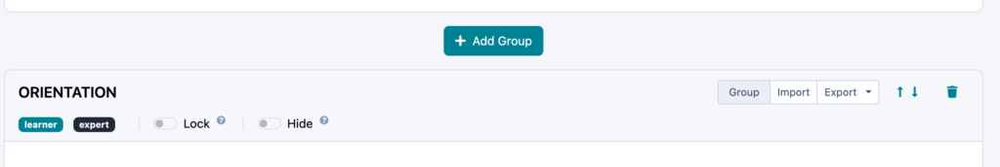

  *     * You can now **import and export Activity Groups** as well to build a library of useful activity groupings like “How to Use Practera”, “Teamwork Skills”, etc.
    * When you export it lets you download the JSON files to your computer but also keeps a copy in a library in Practera. This library will eventually be integrated with the main template library.
    * You can now **move Topics and Assessments to other Activities** – the move button is in “options” when editing a topic or assessment.  

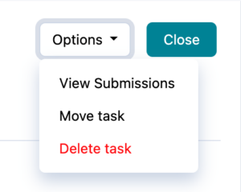. 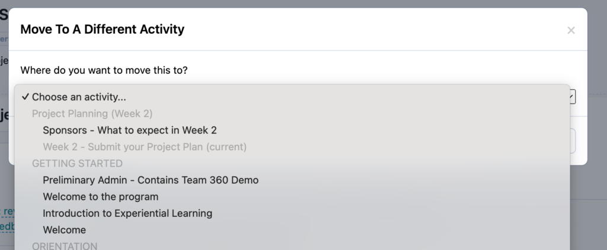

### Delivery:

#### Team 360:

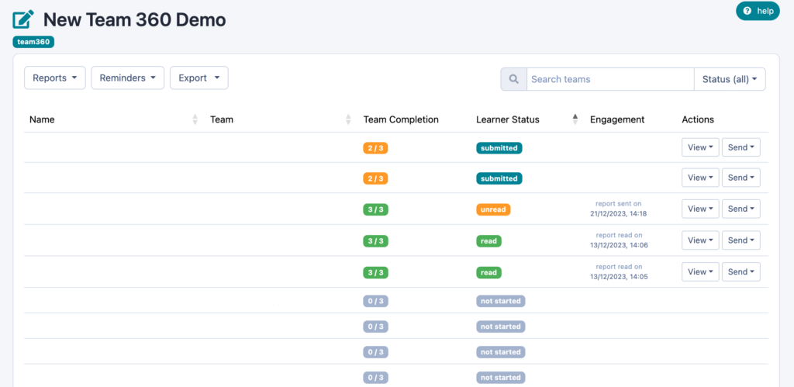

  * Improved UI for report management, allowing you to identify who has submitted, received and read the reports.
  * Ability to send a “Team Coaching report” to experts/coordinators/authors who are part of the learners team, this will contain the entire teams feedback in a nice easy to read format.

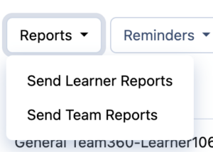

  * New Cohort Team360 CSV export that makes it easier to do cohort analysis, as it provides a team average export table for all learners within the program. Note, If you wish to download everyones individual submissions, this can still be done via the feedback table export function.

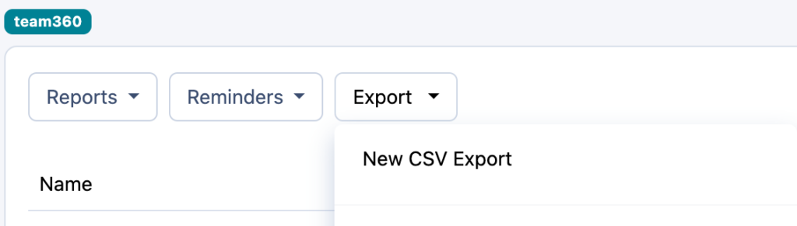

#### Filtered enrolment views:
  * When you click on learners name on parts of the dashboard and the learner name in the Feedback screen you will see just those learners in the enrolment tab. This is in preparation for ELSA changes which will let you take action on these groups.

#### Mark enrolments as “dropped”:
  * Dropped enrolments will not receive further comms and will not be able to access the experience. To mark a learner as dropped you select the user, then click edit enrolment. This will allow you to change their learner status from active to “dropped”

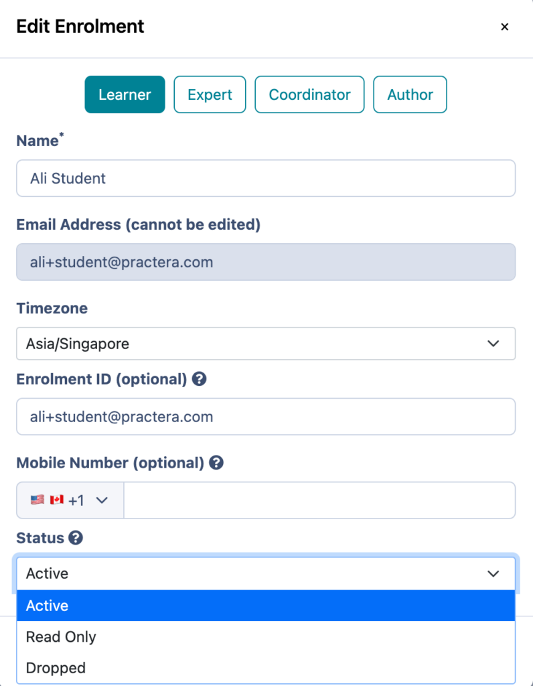

#### Auto Assignment:
  * Now only 1 reviewer will be assigned by auto assignment per learner, which should prevent a range of auto assignment issues.

#### Go Live changes:
  * We now capture start/end dates and other important info during go live, which we will use to ensure the servers are scaled appropriately to handle load during programs

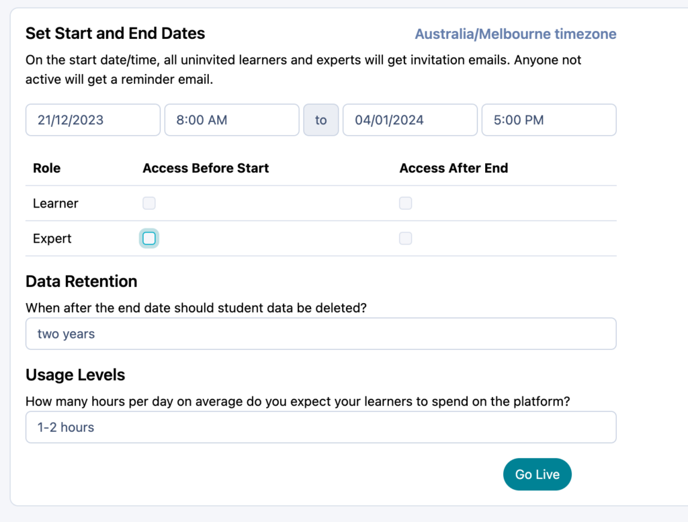

### App:

  * Performance improvements. Pages respond faster, load faster.
  * Activity Groups now show the lead image at the top

Plus lot’s more bug fixes!

---

## Version 2.2.1.9 – Nov 20, 2023

### Admin

  * Security enhancements throughout the admin and API platform. There were no major security issues identified however some non-critical issues were addressed. For example, all API parameters and inputs have always been sanitized to prevent SQL injections, however now they are also type checked and helpful error messages are returned if data sent is of the wrong type.

## Version 2.2.1.8 – Nov 08, 2023

### Admin

  * Admin users with access to multiple institutions were encountering error screens when switching institutions.

## Version 2.2.1.7 – Nov 01, 2023

### General

  * This release was a quick fix to address a submission bug introduced in 2.2.1.6 that occurred for a very specific configuration that had previously not been covered in our release tests.

## Version 2.2.1.6 – Oct 26, 2023

### APP

  * Accessibility Widget – we’ve integrated Accessibe to ensure high levels of support for assistive devices and other usability needs. Click on the icon in the lower left of the app to try it out!
  * Clicking into an activity is now instantly responsive. The same level of responsiveness will happen with tasks in the next release. This creates a much faster user experience.
  * Fixes to ensure that team-based assessments are associated with the correct team. These fixes were a little too aggressive in this release, we will be dialing it back a bit. Specifically, for individual assessments where the reviewer is auto-assigned from the user’s team will fail to submit if the user is not in a team yet. In the next release the submission will go through but the auto-assignment will fail. 

### Assessments

  * Resubmitting a review (that was set to “allow re-review” in the Admin interface) now doesn’t throw an error.
  * When an assessment is the last task in the activity, “mark feedback as read” no longer throws an error
  * Reflections were not submitting if the scoring method was set to percentage

### Certificates

  * Students with Chinese, Japanese, Korean, Vietnamese and Thai characters in their names will now see their names in the certificate instead of garbled boxes.

### Admin

  * Release notes are now linked from the Admin interface – lower left part of the screen

### Admin

  * Moved an expensive API call from the core API to GraphQL, significantly speeding up task loading time.

## Version 2.2.1.5 – Oct 19, 2023

### APP

  * The progress circle on activity bar is updated when going back to the activities list, no need to refresh to see this update.
  * Auto save was not working when an optional textbox was not completed. This has been fixed
  * The text box for assessment responses will now expand once the submitter has written more than 4 lines, making it easier to view and edit as they complete the task.
  * In app FAQ content has been updated and no longer contains placeholder content

### Reviews/Assessments

  * The previous answers to text-type questions for assessment reviews that are placed into “Re-review” are now displayed when the reviewer views the assessment after being placed into “Re-review“.
  * The “Notify before due date“ setting and Calendar button remain the same after changing the assessment type.
  * Able to auto assign on an individual assessment to the assignee role “any:assigned to any member”. This means it will randomly select anyone within the team or program regardless of role. 

### Pulse Checks

  * Pulse checks now appear for both learners and experts when turned on for individual AND team moderated assessments. This occurs whether the learner is in a team or not. The learner gets the pulse check when they read feedback and mark complete. The expert receives the pulse check upon submitting a review. Note at the moment in the case of a peer review the reviewer (learner) will not get a pulse check. This will be fixed in the next patch.

### Triggers and Badges

  * The badge image attachments for the “badge awarded” emails are now attached to the “badge awarded” emails and showing up in mailtrap.
  * Newly created badges are NOT set to open badges automatically.

### Emails

  * There is now text in “badge awarded“ emails for badges with certificates that mention that certificate download links only last for 7 days. Text is: “This link is only valid for one week, so download it now!“.

### Admin Interface

  * If you duplicate the experience the locking and triggers should now work as intended. 
  * The language being set in the newly created experiences now follow what is set in the institution’s language settings
  * You are now able to use the search function to find an administrator in the overview-administrators screen. (The data table error message no longer appears).
  * The team data in the exported status report for a duplicated experience matches current team data and no longer contains the data of the original experience.
  * If an incorrect phone number is input into the enrolment details an error message pops up to identify this issue. 
  * If you delete an experience, the button on the top-right corner of the menu will just redirect you to the “My Experiences” screen.

### Admin & CS Admin:

  * When you switch institutions – either through the dropdown menu or CS admin manager, you now will go to the Institution overview screen vs the “My Experiences” screen. This makes it easier to find the experience you want to go to using the search function.

