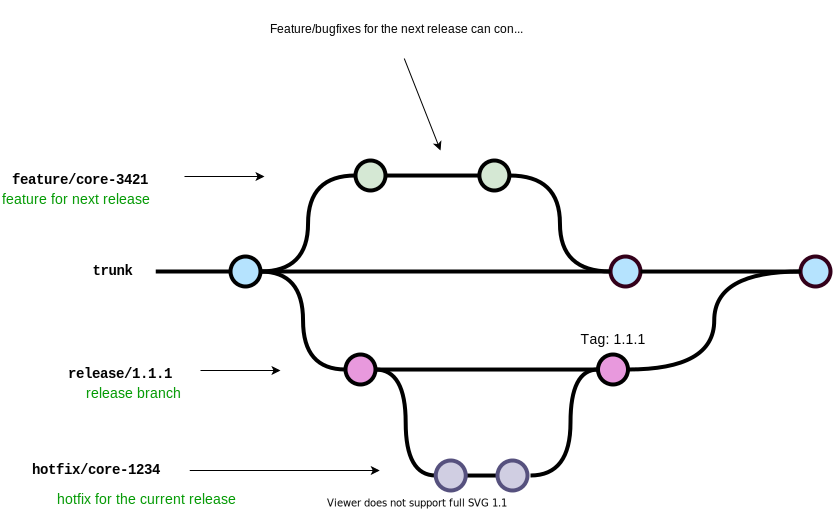

# Git Branches and Environments

## Branches

### trunk

* Main branch of the repo
* Auto deploy to the `stage` environment
* Pull Request require checks(SonarClould, code review)

### develop

* Playground for developer
* Auto deploy to the `sandbox` environment
* Do not require pull request checks. Developer can push to `develop` branch whenever needed, including debug codes

### feature/bugfix/hotfix branch

* Temporary branch
* Used for development
* Auto deleted after pull request get merged
* Naming convention `{prefix}/{JIRA story code}/{JIRA story title}`
  * `feature/CORE-1234/Example-feature-core-story`
  * `bugfix/AV2-123/Example-bugfix-app-story`
  * `hotfix/CUT-123/Example-hotfix-cutie-story`

### release branch

* Temporary branch
* Used for release
* Deleted after release
* Naming convention `release/{version}`
  * `release/1.3.5`

## Environments

### Live

* Production environment
* Deployed from tag release

### Stage

* Deployed from `trunk` branch
* Configuration same as live environment
* Connect to Stage Global Login service
* Mainly used as testing environment for QA

### Sandbox

* Deployed from `develop` branch
* Connect to Stage Login service
* Disable global login for CORE (so that we don’t need to do MFA)
* Mainly used as a playground for developers

## Development workflows

### Small Feature development

* Branch out from `trunk` branch
* Merge to `develop` branch for developer to test
* Create PR to `trunk` once development finished
* Merge to `trunk` for QA to test

### Big Feature development

* Branch out from `trunk` branch as a main feature branch
* Merge to `develop` branch for developer to test
* Create PR to the feature branch
* Once feature branch ready, create PR to `trunk`
* Merge to `trunk` for QA to test

### Bugfix/hotfix development

* Branch out from `trunk` branch
* Merge to `develop` branch for developers to test
* Create PR to `trunk` once done
* Merge to `trunk` for QA to test

### Release

* Create a temporary release branch out from `trunk` branch
* Fixes for this release goes to the release branch
* Once the release branch is ready to be released, create a tag on the release branch and proceed with the release
* Merge the release branch back to `trunk`

