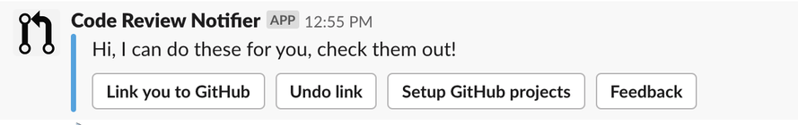

# Set up code reviewer notifier

This documentation tells about how to set up the Github Code Reviewer Notifier for Slack.

## Set up Code Review Notifier webhook for repo

* This is used for the admin of a GitHub repository to add a webhook for the repo, so that other people can be notified when a review assigned

* *Note: only the admin of the repo needs to set up this. Other people just need to enable the Code Review Notifier for yourself.*

1. Go to the "Settings" of the GitHub repository
1. Go to the "Webhooks" on the left side bar
1. Click "Add webhook"
1. Put `https://github-code-review-notifier.now.sh/github?workspace=T02TCHV4Y` as the "Payload URL"
1. In "**Which events would you like to trigger this webhook?**" part, select "Let me select individual events.", and only select "Pull requests" and "Pull request reviews"
1. Click "Add webhook"

## Enable Code Review Notifier for yourself

1. In Slack, send a direct message to Code Review Notifier. (e.g. "hi")
1. Code Review Notifier will give you options to config
  
1. Click "Link you to GitHub" and type your GitHub account name to link it

## Test

Try to assign yourself as the reviewer of a Pull Request. See if you can get a notification

## References

* [CodeReviewerNotifier](https://enixcoda.github.io/github-code-review-notifier/)
* [Original Documentation](https://intersective.atlassian.net/wiki/spaces/KB/pages/662667385/Set+up+code+reviewer+notifier)
