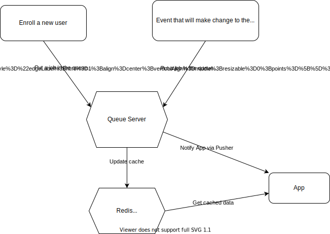

# API Cache Design Patten

## Backgound

We have some APIs that take a long time to proceed. The end users will see a loading indicator for a while before they can see the content. Even worse, some of the APIs may timeout because of that. As a result, our end users will never see the content anymore.

## Solution

We have come up with a solution to handle this with cache.

## Workflow

1. When we retrieve the data we need, we always retrieve it from the cache, instead of querying from the API.
2. When we enroll a new user to the experience, initialise the cached data for this user.
3. When some event happens that will change the cached data, put a job in the __queue__ to re-calculate the data and update the cache.
4. Once the cache has been updated to the latest, notify the user with a Pusher event.

## Example workflow

Progress:

1. When we enroll a new user, put a job in the queue to initiate the progress cache.
2. When the user go to the App to see the progress, API will get it from the cache.
3. When the user submit an assesssment that will change the progress, put a job in the queue to update the cache.
4. Once the cache has been updated, notify the App via Pusher channel.
5. When App receive the Pusher event, retrieve the data from cache again.

## APIs

We've implemented this cache strategy to the following APIs:

* [CORE] `/api/milestones`
* [CORE] `/api/v2/motivations/progress/list`
