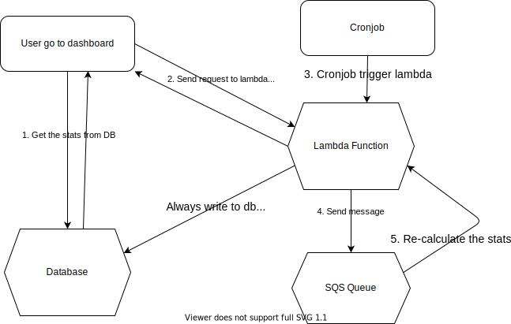

# Dashboard Statistics

## Background

Admin/coordinator need to see a few statistics on the experience dashboard to know if the experience is on track.

The statistics could be complex to calculate and grow to a large number. We can not just calculate everything on the fly. Instead, we pre-calculate the statistics and store the result in db, so that we can display them immediately when admin/coordinator go to the dashboard

## Key logic

1. When user go to the dashboard, get the stats from the database and display them on the page.
2. At the same time, send a request to re-calculate the stats. Once the result returns, update the UI on the dashboard.
3. A cronjob runs in the background and trigger lambada function regularly.
4. The lambda function will get all the experiences that need re-calculation, and send a message to SQS Queue for each experience.
5. The lambda function listen to the SQS Queue to calculate the stats for each experience.

