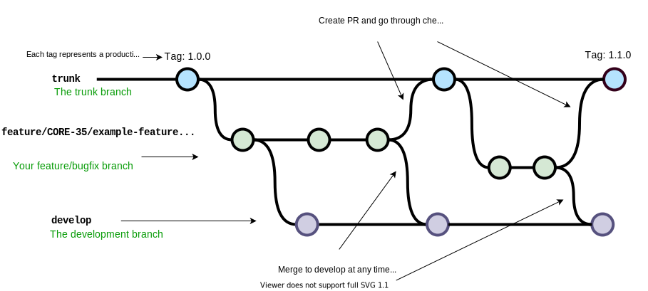
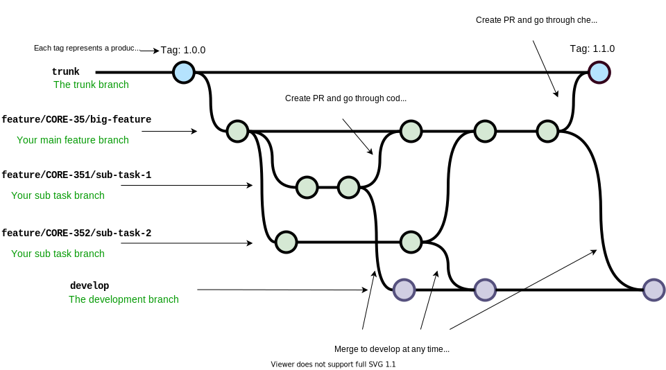

# Git Branches and Environments

## Branches

### trunk

* Default branch of the repo
* Require checks(SonarClould, code review) for PR
* Auto deploy to the `stage` environment
* Tag release to live

### develop

* Auto deploy to sandbox environment
* Do not require checks. Developer can push to `develop` branch whenever needed

## Environments

### Live

* Deployed from tag release of `trunk` branch
* Production environment

### Stage

* Deployed from `trunk` branch
* Configuration same as live environment
* Connect to Stage Global Login service
* Mainly used as testing environment for QA

### Sandbox

* Deployed from `develop` branch
* Connect to Stage Login service
* Disable global login for CORE (so that don’t need to do MFA)
* Mainly as a playground for developers

## Development workflows

### Small Feature development

* Branch out from `trunk` branch
* Merge to `develop` branch for developers to test
* Create PR to `trunk` once done
* Merge to `trunk` for QA to test
* Tag release to live once QA passed

### Bugfix/hotfix development

* Branch out from `trunk` branch
* Merge to `develop` branch for developers to test
* Create PR to `trunk` once done
* Merge to `trunk` for QA to test
* Tag release to live once QA passed

### Big Feature development

* Branch out from `trunk` branch as a main feature branch
* Merge to `develop` branch for developers to test
* Create PR to the feature branch
* Once feature branch ready, create PR to `trunk`
* Merge to `trunk` for QA to test
* Tag release to live once QA passed

