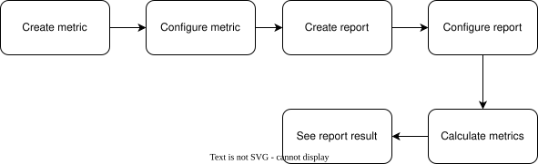

# Metrics

Metric is used to allow admin configuring custom metrics for an assessment to see the answers in a proper way.

## New DB Table

### `analytics_metrics`

* `id` id of this metric
* `uuid` uuid of this metric
* `name` the name of this metric
* `description` the description of this metric
* `is_public` whether this is a public metrics in the metrics library
* `data_source` : which data source we are linking to for the calculation
  * For MVP, we only support `question`
* `data_type` defines how to link to an assessment question. It has the following valid value (MVP):
  * `scalar` : can only be linked to a radio button choice question of an assessment
* `aggregation` defines how to calculate the result. It has the following valid value: (when the `data_type` is `scalar`)
  * `average` : the result will be the average `weight` of the answers for this question
  * `average_rate` : the result will be the average `weight` of the answers / max `weight` for this question
  * `sum` : the result will be the sum of the `weight` of the answers for this question
  * `count` : the result will be the count of the user that has answered that question
* `filters` : the filters applied to this metric
  * This is a JSON encoded field that contain 2 attributes
  * `role`: an array of filtered roles. Valid `role` are `participant`, `mentor`, `coordinator`, `admin`
  * `status`: an array of filtered user status. Valid `status` are `active`, `dropped`
* `default_calculation_frequency`

### `analytics_metric_institutions`

Relationship between a metric and an institution

* `id`
* `metric_id`
* `institution_id`
* `requirement` has the following valid value:
  * `required` : without linking this metric to an assessment, an experience can not go live
  * `recommanded` : an experience can go live without linking this metric to an assessment, but there will be a warning
  * `not required` : an experience can go live without linking this metric to an assessment
* `status`
  * `inactive` : when this metric is not linked to any assessment question in any experience
  * `active` : when the metric is linked to an assessment question in an experience
  * `archived` : the metric won't be calculated anymore

### `analytics_metric_links`

Relationship between a metric and a data source link in an experience

* `id`
* `metric_id`
* `data_source_id` : the related data source id
  * When `data_source` = `question`, this id is the question id
  * When `data_source` = `assessment`, this id is the assessment id
  * When `data_source` = `user` or `pulse-check`, this id is the experience id
* `experience_id`
* `institution_id`
* `calculation_frequency` : when to calculate the metrics
  * `on demand` : we only support on demand calculation for MVP

### `analytics_metric_records`

The table to store the metric report records

* `id`
* `metric_link_id`
* `value` : metric data value result
* `count` : how many data have we gone through to do the calculation
* `created` : date when the record gets calculated

## Metric Types

Each combination of data source and data type represents a different metric calculation approach. Below is a comprehensive list of all supported data source and data type combinations:

<table>
<tr>
<th>data_source</th>
<th>data_type</th>
<th>aggregation</th>
<th>description</th>
<th>report type</th>
</tr>

<tr>
<td rowspan="6">question</td>
<td rowspan="6">scalar</td>
<td>average</td>
<td>The average value of the weight of the question choice</td>
<td rowspan="5">circle number, card, table</td>
</tr>
<tr>
<td>average_rate</td>
<td>The average weight / max weight</td>
</tr>
<tr>
<td>sum</td>
<td>The sum value of the weight of the question choice</td>
</tr>
<tr>
<td>count</td>
<td>Count how many users have answered this question</td>
</tr>
<tr>
<td>net-promoter</td>
<td>Calculate the net promoter of the question. (only available for choice weight 1-5 or 1-10)</td>
</tr>
<tr>
<td>distribution</td>
<td>Get the answer distribution of this question</td>
<td>pie chart</td>
</tr>

<tr>
<td rowspan="2">assessment</td>
<td>submitted-user</td>
<td rowspan="2">count</td>
<td>Count how many users have submitted this assessment</td>
<td rowspan="5">circle number, card, table</td>
</tr>
<tr>
<td>submitted-team</td>
<td>Count how many teams have submitted this assessment</td>
</tr>

<tr>
<td rowspan="3">user</td>
<td>participant</td>
<td rowspan="3">count</td>
<td>The total number of learners</td>
</tr>
<tr>
<td>mentor</td>
<td>The total number of experts</td>
</tr>
<tr>
<td>team</td>
<td>The total number of teams</td>
</tr>

<tr>
<td>pulse-check</td>
<td>skills</td>
<td>average</td>
<td>The average skills growth of the experience</td>
<td>bar chart</td>
</tr>
</table>

## Workflow

### Create metric

There will be a page on the institution level to see all the metrics in the institution and institution admin is able to create new metric or use a metric from the metric library.

### Configure metric

On the experience dashboard, there will be a "metrics" tab. Admin can configure the metric (i.e. link metric to a specific assessment question).

`required` metric and `recommanded` metric will have special indicator to remind the admin to do the configuration. If they are not configured properly, when admin try to make the experience live, it will popup some warning message.

### Create report

After configuring metrics, admin can create a new report to organize and display the metric data. The report creation allows selecting which metrics to include and defining the report structure.

### Configure report

Once a report is created, admin can configure various aspects of the report including:
- Report section name
- Report type (circle number, card, table, pie chart, bar chart)
- Visual presentation settings

### Trigger metric calculation

On MVP, we will only implement on demand calculation. There will be a button on the experience dashboard "metrics" tab to trigger the calculation

### View report results

After triggering the calculation, admin can view the report results in the configured format. The results will display the calculated metric values based on the selected report type and configuration settings.

### Export metric result report

There will be a button in the experience dashboard "metrics" tab to export the report CSV

Example report CSV:

| Metric         | Description    | Agg Method | 01/01/2024 Value | 01/01/2024 Count | 01/10/2024 Value | 01/10/2024 Count |
|----------------|-------------------|------------|------------|-----------------|-----------------|-----------------|
| WTR        | Willingness to Recommend      | Average    | 0.7             | 60        | 0.6        | 100             |
| Skill: Communication     | 1-5 scale self assessment of communication skill level, 1 being lowest, 5 highest | Average    | 0.9             | 120             | 0.8             | 150             |
| Opt-in for Research      | Count of students who answer Yes to allowing their data to be used for research     | Sum        | 140             | 160             | 170             | 200             |
| Provided Optional Feedback | Count of students who provided any answer at all to an optional text feedback question.  | Count      | 60              | 120             | 75              | 150             |

## Tasks

1. Create new db tables **[API]**
2. List all the metrics in the institution *(institution setting page)*
   1. Page for the list **[UI]**
   2. API for the list **[API]**
3. Add a new metric *(institution setting page)*
   1. Add a fresh new metrics from a form **[UI]**
   2. API to create a new metric with form data **[API]**
   3. Add a new metric from the metrics library
      1. List the metrics in the library **[UI]**
      2. API to list the metrics in the library **[API]**
      3. API to add a new metric with a given metrics id from library **[API]**
4. Edit metric *(institution setting page)*
   1. Page to edit metric **[UI]**
   2. API to edit metric **[API]**
5. List all the metrics in the institution *(experience setting page)*
   1. Page for the list (indicate whether each metrics is configured or not) **[UI]**
   2. API for the list (including the configuration in the experience) **[API]**
6. Configure a metric in the experience. i.e. link a metric to an assessment question *(experience setting page)*
   1. Page to link metric to a question (inside an experience) **[UI]**
   2. API to list assessment questions **[API]**
   3. API to link metric to a question **[API]**
7. Trigger the calculation of a single metric or all metrics *(experience setting page)*
   1. A button to trigger the calculation **[UI]**
   2. API to do the calculation **[API]**
8. Download the report CSV *(experience setting page)*
   1. A button to download the report CSV **[UI]**
   2. API to respond with report data **[API]**
